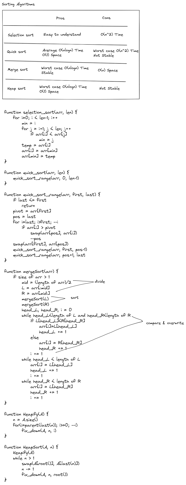
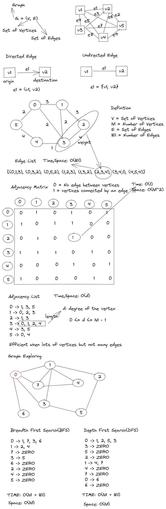
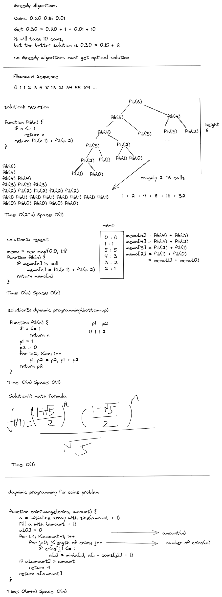

最近在喵jomaclass的data-structures的课程，这里简单做个记录。推荐一个网站，[algorithm-visualizer](https://algorithm-visualizer.org/)，在线可视化进行数据结构跟算法分析，比较直观。

## Course Theory

### Instruction

![instruction][./ecd/dsa/instruction.png]

### Time complexity

know more https://en.wikipedia.org/wiki/Big_O_notation

### Memory Model

### List

### Stack-queue

### Tree

### HashTable and Dictonary

### Heap and Priority Queue

### Sorting Algorithms

### Graph

### Greedy and Dynimic Programming

