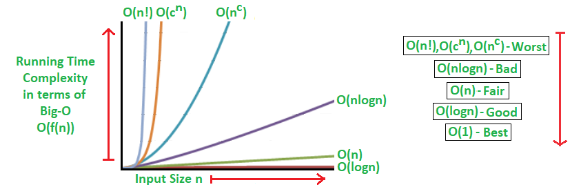
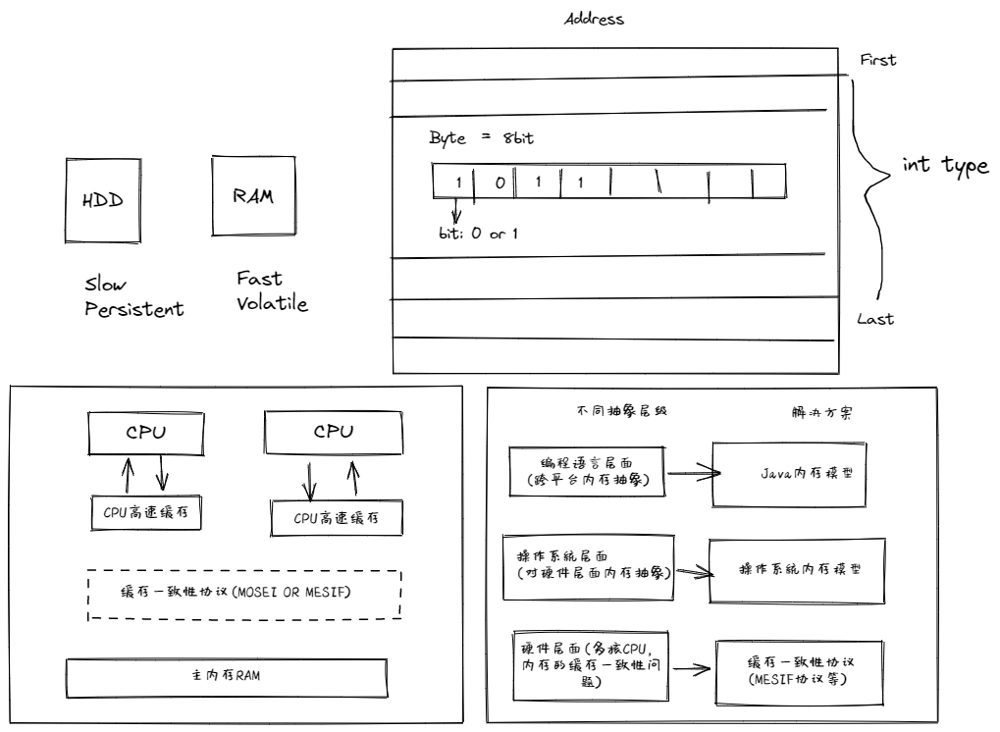
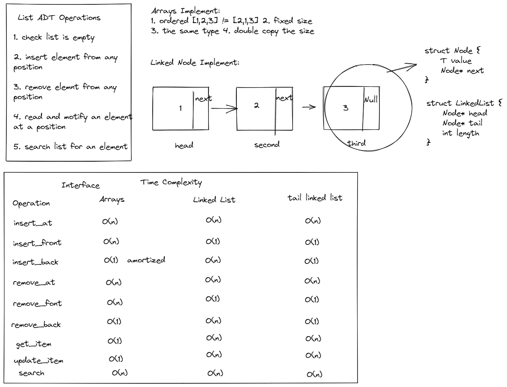
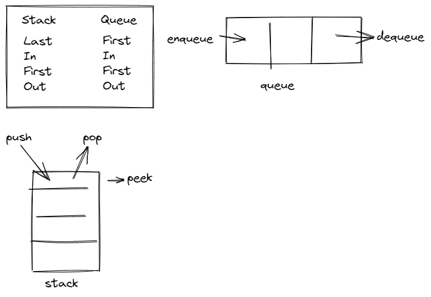
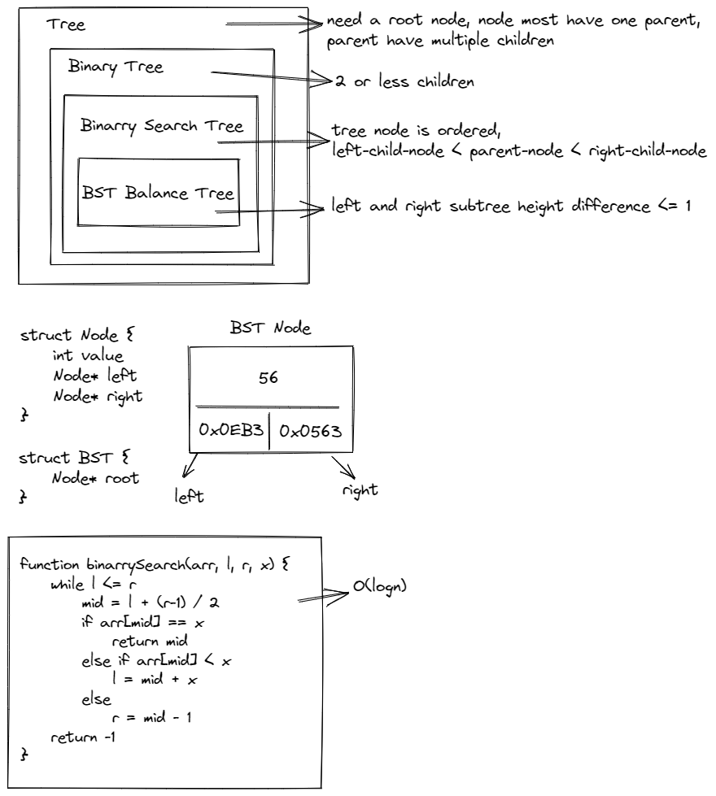
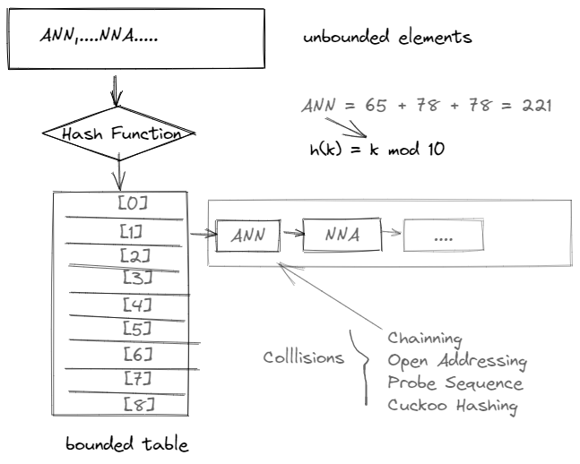
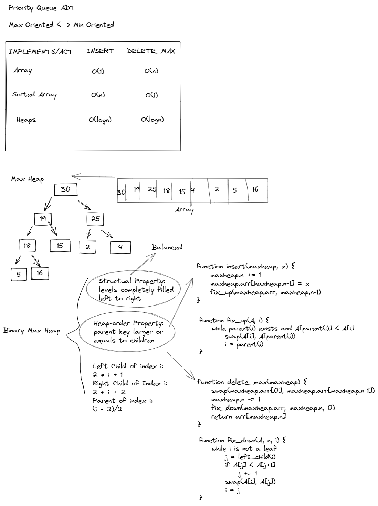

## Data structures

### Instruction

![instruction][./ecd/dsa/instruction.png]

### Time complexity

know more https://en.wikipedia.org/wiki/Big_O_notation

### Memory Model

### List

### Stack-queue

### Tree

### HashTable and Dictonary

### Heap and Priority Queue

### Sorting Algorithms

