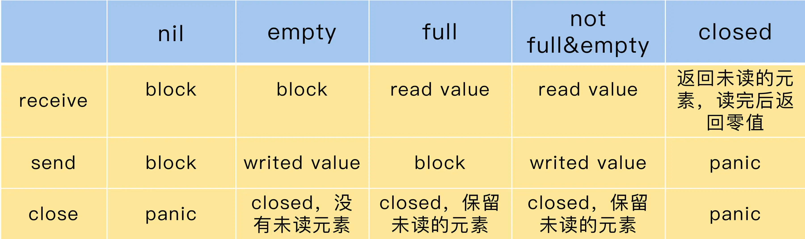

最近喵了极客时间[go并发编程实战课](https://time.geekbang.org/column/intro/100061801)，这里简单做个记录

## mutex

[http://legendtkl.com/2016/10/23/golang-mutex/](http://legendtkl.com/2016/10/23/golang-mutex/)

[https://boilingfrog.github.io/2021/03/14/sync.Mutex/](https://boilingfrog.github.io/2021/03/14/sync.Mutex/)

[Understanding Real-World Concurrency Bugs in Go](https://songlh.github.io/paper/go-study.pdf)

### 同步原理的适用场景

1. 共享资源。并发地读写共享资源，会出现数据竞争（data race）的问题，所以需要 Mutex、RWMutex 这样的并发原语来保护。
2. 任务编排。需要 goroutine 按照一定的规律执行，而 goroutine 之间有相互等待或者依赖的顺序关系，我们常常使用 WaitGroup 或者 Channel 来实现。
3. 消息传递。信息交流以及不同的 goroutine 之间的线程安全的数据交流，常常使用 Channel 来实现。

互斥锁(Mutex)是使用最广泛的同步原语 Synchronization primitives，是信号量(Semaphore)的一种

### 互斥锁的实现机制

**临界区**: 在并发编程中，如果程序中的一部分会被并发访问或修改，
那么，为了避免并发访问导致的意想不到的结果，这部分程序需要被保护起来，
这部分被保护起来的程序，就叫做临界区。

使用互斥锁，限定临界区只能同时由一个线程持有

### 问题

如果 Mutex 已经被一个 goroutine 获取了锁，其它等待中的 goroutine 们只能一直等待。那么，等这个锁释放后，等待中的 goroutine 中哪一个会优先获取 Mutex 呢？

等待的goroutine们是以FIFO排队的
1）当Mutex处于正常模式时，若此时没有新goroutine与队头goroutine竞争，则队头goroutine获得。若有新goroutine竞争大概率新goroutine获得。
2）当队头goroutine竞争锁失败1ms后，它会将Mutex调整为饥饿模式。进入饥饿模式后，锁的所有权会直接从解锁goroutine移交给队头goroutine，此时新来的goroutine直接放入队尾。
3）当一个goroutine获取锁后，如果发现自己满足下列条件中的任何一个#1它是队列中最后一个#2它等待锁的时间少于1ms，则将锁切换回正常模式
以上简略翻译自https://golang.org/src/sync/mutex.go 中注释Mutex fairness.

### mutex实现

**CAS**: CAS 指令将给定的值和一个内存地址中的值进行比较，如果它们是同一个值，就使用新值替换内存地址中的值，这个操作是原子性的。
原子性保证这个指令总是基于最新的值进行计算，如果同时有其它线程已经修改了这个值，那么，CAS 会返回失败。

**Unlock 方法可以被任意的 goroutine 调用释放锁，即使是没持有这个互斥锁的 goroutine，也可以进行这个操作。
这是因为，Mutex 本身并没有包含持有这把锁的 goroutine 的信息，所以，Unlock 也不会对此进行检查。
Mutex 的这个设计一直保持至今。**

### 位运算
```
&      位运算 AND
|      位运算 OR
^      位运算 XOR
&^     位清空（AND NOT）
<<     左移
>>     右移
```
**&**
参与运算的两数各对应的二进位相与，两个二进制位都为1时，结果才为1
```
    0101
AND 0011
  = 0001
```

**|**
参与运算的两数各对应的二进位相或，两个二进制位都为0时，结果才为0
```
   0101（十进制5）
OR 0011（十进制3）
 = 0111（十进制7）
```

**^**
按位异或运算，对等长二进制模式或二进制数的每一位执行逻辑异或操作。操作的结果是如果某位不同则该位为1，否则该位为0
```
    0101
XOR 0011
  = 0110
```

**&^**
将运算符左边数据相异的位保留，相同位清零
```
   0001 0100 
&^ 0000 1111 
 = 0001 0000  
```

**<<**
各二进位全部左移若干位，高位丢弃，低位补0
```
   0001（十进制1）
<< 3（左移3位）
 = 1000（十进制8）
```

**>>**
各二进位全部右移若干位，对无符号数，高位补0，有符号数，各编译器处理方法不一样，有的补符号位（算术右移），有的补0
```
   1010（十进制10）
>> 2（右移2位）
 = 0010（十进制2）
```

### 错误用法
1. Lock/Unlock 不是成对出现
2. Copy 已使用的 Mutex，Mutex 是一个有状态的对象，它的 state 字段记录这个锁的状态。
3. 重入，Mutex 不是可重入的锁，因为 Mutex 的实现中没有记录哪个 goroutine 拥有这把锁。理论上，任何 goroutine 都可以随意地 Unlock 这把锁
4. 死锁

### 死锁
1. 互斥： 至少一个资源是被排他性独享的，其他线程必须处于等待状态，直到资源被释放。
2. 持有和等待：goroutine 持有一个资源，并且还在请求其它 goroutine 持有的资源，也就是咱们常说的“吃着碗里，看着锅里”的意思。
3. 不可剥夺：资源只能由持有它的 goroutine 来释放。
4. 环路等待：一般来说，存在一组等待进程，P={P1，P2，…，PN}，P1 等待 P2 持有的资源，P2 等待 P3 持有的资源，依此类推，最后是 PN 等待 P1 持有的资源，这就形成了一个环路等待的死结。

死锁检测，[go-tools](https://github.com/dominikh/go-tools)，[go-deadlock](https://github.com/sasha-s/go-deadlock) ，或者使用go pprof工具分析

### RWMutex

[Readers–writers_problem](https://en.wikipedia.org/wiki/Readers%E2%80%93writers_problem)

readers-writers 问题一般有三类，基于对读和写操作的优先级，读写锁的设计和实现也分成三类。
1. Read-preferring：读优先的设计可以提供很高的并发性，但是，在竞争激烈的情况下可能会导致写饥饿。这是因为，如果有大量的读，这种设计会导致只有所有的读都释放了锁之后，写才可能获取到锁。
2. Write-preferring：写优先的设计意味着，如果已经有一个 writer 在等待请求锁的话，它会阻止新来的请求锁的 reader 获取到锁，所以优先保障 writer。当然，如果有一些 reader 已经请求了锁的话，新请求的 writer 也会等待已经存在的 reader 都释放锁之后才能获取。所以，写优先级设计中的优先权是针对新来的请求而言的。这种设计主要避免了 writer 的饥饿问题。
3. 不指定优先级：这种设计比较简单，不区分 reader 和 writer 优先级，某些场景下这种不指定优先级的设计反而更有效，因为第一类优先级会导致写饥饿，第二类优先级可能会导致读饥饿，这种不指定优先级的访问不再区分读写，大家都是同一个优先级，解决了饥饿的问题。

如果你遇到可以明确区分 reader 和 writer goroutine 的场景，且有大量的并发读、少量的并发写，并且有强烈的性能需求，你就可以考虑使用读写锁 RWMutex 替换 Mutex

## waitgroup

一般用于**任务编排**，比如，我们要完成一个大的任务，需要使用并行的 goroutine 执行三个小任务，只有这三个小任务都完成，我们才能去执行后面的任务

它要解决的就是并发 - 等待的问题：现在有一个 goroutine A 在检查点（checkpoint）等待一组 goroutine 全部完成，
如果在执行任务的这些 goroutine 还没全部完成，那么 goroutine A 就会阻塞在检查点，直到所有 goroutine 都完成后才能继续执行。

其实，很多操作系统和编程语言都提供了类似的并发原语。比如，Linux 中的 barrier、Pthread（POSIX 线程）中的 barrier、C++ 中的 std::barrier、Java 中的 CyclicBarrier 和 CountDownLatch 等

### 基本方法
1. Add，用来设置 WaitGroup 的计数值；
2. Done，用来将 WaitGroup 的计数值减 1，其实就是调用了 Add(-1)；
3. Wait，调用这个方法的 goroutine 会一直阻塞，直到 WaitGroup 的计数值变为 0。

### 实现

**数据结构**

```go
type WaitGroup struct {
    // 避免复制使用的一个技巧，可以告诉vet工具违反了复制使用的规则
    noCopy noCopy
    // 64bit(8bytes)的值分成两段，高32bit是计数值，低32bit是waiter的计数
    // 另外32bit是用作信号量的
    // 因为64bit值的原子操作需要64bit对齐，但是32bit编译器不支持，所以数组中的元素在不同的架构中不一样，具体处理看下面的方法
    // 总之，会找到对齐的那64bit作为state，其余的32bit做信号量
    state1 [3]uint32
}


// 得到state的地址和信号量的地址
func (wg *WaitGroup) state() (statep *uint64, semap *uint32) {
    if uintptr(unsafe.Pointer(&wg.state1))%8 == 0 {
        // 如果地址是64bit对齐的，数组前两个元素做state，后一个元素做信号量
        return (*uint64)(unsafe.Pointer(&wg.state1)), &wg.state1[2]
    } else {
        // 如果地址是32bit对齐的，数组后两个元素用来做state，它可以用来做64bit的原子操作，第一个元素32bit用来做信号量
        return (*uint64)(unsafe.Pointer(&wg.state1[1])), &wg.state1[0]
    }
}
```

**方法**

```go

func (wg *WaitGroup) Add(delta int) {
    statep, semap := wg.state()
    // 高32bit是计数值v，所以把delta左移32，增加到计数上
    state := atomic.AddUint64(statep, uint64(delta)<<32)
    v := int32(state >> 32) // 当前计数值
    w := uint32(state) // waiter count

    if v > 0 || w == 0 {
        return
    }

    // 如果计数值v为0并且waiter的数量w不为0，那么state的值就是waiter的数量
    // 将waiter的数量设置为0，因为计数值v也是0,所以它们俩的组合*statep直接设置为0即可。此时需要并唤醒所有的waiter
    *statep = 0
    for ; w != 0; w-- {
        runtime_Semrelease(semap, false, 0)
    }
}


// Done方法实际就是计数器减1
func (wg *WaitGroup) Done() {
    wg.Add(-1)
}


func (wg *WaitGroup) Wait() {
    statep, semap := wg.state()
    
    for {
        state := atomic.LoadUint64(statep)
        v := int32(state >> 32) // 当前计数值
        w := uint32(state) // waiter的数量
        if v == 0 {
            // 如果计数值为0, 调用这个方法的goroutine不必再等待，继续执行它后面的逻辑即可
            return
        }
        // 否则把waiter数量加1。期间可能有并发调用Wait的情况，所以最外层使用了一个for循环
        if atomic.CompareAndSwapUint64(statep, state, state+1) {
            // 阻塞休眠等待
            runtime_Semacquire(semap)
            // 被唤醒，不再阻塞，返回
            return
        }
    }
}
```

### 常见错误

1. 计数器设置为负值
2. 调用 Done 方法的次数过多，超过了 WaitGroup 的计数值
3. 没有等所有的 Add 方法调用之后再调用 Wait
4. 前一个 Wait 还没结束就重用 WaitGroup，WaitGroup， 比如等一组比赛的所有选手都跑完后 5 分钟，才开始下一组比赛。下一组比赛还可以使用这个 WaitGroup 来控制，因为 WaitGroup 是可以重用的。只要 WaitGroup 的计数值恢复到零值的状态，那么它就可以被看作是新创建的 WaitGroup，被重复使用

### 使用总结

1. 不重用 WaitGroup。新建一个 WaitGroup 不会带来多大的资源开销，重用反而更容易出错。
2. 保证所有的 Add 方法调用都在 Wait 之前。
3. 不传递负数给 Add 方法，只通过 Done 来给计数值减 1。
4. 不做多余的 Done 方法调用，保证 Add 的计数值和 Done 方法调用的数量是一样的。
5. 不遗漏 Done 方法的调用，否则会导致 Wait hang 住无法返回。

### noCopy: 辅助vet检查

它就是指示 vet 工具在做检查的时候，这个数据结构不能做值复制使用。更严谨地说，是不能在第一次使用之后复制使用 ( must not be copied after first use)。

Mutex 的时候用到了 vet 工具。vet 会对实现 Locker 接口的数据类型做静态检查，一旦代码中有复制使用这种数据类型的情况，就会发出警告。但是，WaitGroup 同步原语不就是 Add、Done 和 Wait 方法吗？vet 能检查出来吗？

其实是可以的。通过给 WaitGroup 添加一个 noCopy 字段，我们就可以为 WaitGroup 实现 Locker 接口，这样 vet 工具就可以做复制检查了。而且因为 noCopy 字段是未输出类型，所以 WaitGroup 不会暴露 Lock/Unlock 方法。

noCopy 字段的类型是 noCopy，它只是一个辅助的、用来帮助 vet 检查用的类型:

```go
type noCopy struct{}
    // Lock is a no-op used by -copylocks checker from `go vet`.
    func (*noCopy) Lock()   {}
    func (*noCopy) Unlock() {}
```

如果你想要自己定义的数据结构不被复制使用，或者说，不能通过 vet 工具检查出复制使用的报警，就可以通过嵌入 noCopy 这个数据类型来实现。

### 内存对齐

[memory-layout](https://go101.org/article/memory-layout.html)

## cond

等待 / 通知（wait/notify）机制

请实现一个限定容量的队列（queue），当队列满或者空的时候，利用等待 / 通知机制实现阻塞或者唤醒。

从开发实践上，我们真正使用 Cond 的场景比较少，因为一旦遇到需要使用 Cond 的场景，我们更多地会使用 Channel 的方式，因为那才是更地道的 Go 语言的写法，[issues/21165](https://github.com/golang/go/issues/21165)

### 基本方法

```go
type Cond
    func NeWCond(l Locker) *Cond
    func (c *Cond) Broadcast()
    func (c *Cond) Signal()
    func (c *Cond) Wait()
```

Cond 关联的 Locker 实例可以通过 c.L 访问，它内部维护着一个先入先出的等待队列。

[通用方法名](https://en.wikipedia.org/wiki/Monitor_(synchronization)#Condition_variables_2)

1. Signal 方法，允许调用者 Caller 唤醒一个等待此 Cond 的 goroutine。如果此时没有等待的 goroutine，显然无需通知 waiter；如果 Cond 等待队列中有一个或者多个等待的 goroutine，则需要从等待队列中移除第一个 goroutine 并把它唤醒。在其他编程语言中，比如 Java 语言中，Signal 方法也被叫做 notify 方法。调用 Signal 方法时，不强求你一定要持有 c.L 的锁。
2. Broadcast 方法，允许调用者 Caller 唤醒所有等待此 Cond 的 goroutine。如果此时没有等待的 goroutine，显然无需通知 waiter；如果 Cond 等待队列中有一个或者多个等待的 goroutine，则清空所有等待的 goroutine，并全部唤醒。在其他编程语言中，比如 Java 语言中，Broadcast 方法也被叫做 notifyAll 方法。同样地，调用 Broadcast 方法时，也不强求你一定持有 c.L 的锁。
3. Wait 方法，会把调用者 Caller 放入 Cond 的等待队列中并阻塞，直到被 Signal 或者 Broadcast 的方法从等待队列中移除并唤醒。

### 常见错误

1. Cond 最常见的使用错误，也就是调用 Wait 的时候没有加锁。
2. 只调用了一次 Wait

如果你想在使用 Cond 的时候避免犯错，只要时刻记住调用 cond.Wait 方法之前一定要加锁，以及 waiter goroutine 被唤醒不等于等待条件被满足这两个知识点。

## once

Once 可以用来执行且仅仅执行一次动作，常常用于单例对象的延迟初始化场景

### 单例对象初始化，非延迟

定义package级别的变量

```go

package abc

import time

var startTime = time.Now()
```

或者在init函数执行

```go

package abc

var startTime time.Time

func init() {
  startTime = time.Now()
}

```

又或者在main函数开始执行的时候，执行要给初始化函数

```go

package abc

var startTime time.Tim

func initApp() {
    startTime = time.Now()
}
func main() {
  initApp()
}
```

### 延迟加锁

```go

package main

import (
	"net"
	"sync"
	"time"
)

// 使用互斥锁保证线程(goroutine)安全
var connMu sync.Mutex
var conn net.Conn

func getConn() net.Conn {
	connMu.Lock()
	defer connMu.Unlock()

	// 返回已创建好的连接
	if conn != nil {
		return conn
	}

	// 创建连接
	conn, _ = net.DialTimeout("tcp", "baidu.com:80", 10*time.Second)
	return conn
}

// 使用连接
func main() {
	conn := getConn()
	if conn == nil {
		panic("conn is nil")
	}
}
```

### Once使用场景

Once 的使用场景sync.Once 只暴露了一个方法 Do，你可以多次调用 Do 方法，但是只有第一次调用 Do 方法时 f 参数才会执行，这里的 f 是一个无参数无返回值的函数。

Once 常常用来初始化单例资源，或者并发访问只需初始化一次的共享资源，或者在测试的时候初始化一次测试资源

## pool

Go 是一个自动垃圾回收的编程语言，采用[三色并发标记算法](https://go.dev/blog/ismmkeynote)标记对象并回收

Go 的自动垃圾回收机制还是有一个 STW（stop-the-world，程序暂停）的时间，而且，大量地创建在堆上的对象，也会影响垃圾回收标记的时间

### sync.pool

1. sync.Pool，它池化的对象可能会被垃圾回收掉，这对于数据库长连接等场景是不合适的
2. sync.Pool 本身就是线程安全的，多个 goroutine 可以并发地调用它的方法存取对象；
3. sync.Pool 不可在使用之后再复制使用。
4. 注意内存泄露跟内存浪费

### 第三方库

1. [bytebufferpool](https://github.com/valyala/bytebufferpool)
2. [oxtoacart/bpool](https://github.com/oxtoacart/bpool)
3. [gammazero/workerpool](https://pkg.go.dev/github.com/gammazero/workerpool)
4. [ivpusic/grpool](https://pkg.go.dev/github.com/ivpusic/grpool)
5. [dpaks/goworkers](https://pkg.go.dev/github.com/dpaks/goworkers)

## context

### 使用场景
1. 上下文信息传递 （request-scoped），比如处理 http 请求、在请求处理链路上传递信息；
2. 控制子 goroutine 的运行；
3. 超时控制的方法调用；
4. 可以取消的方法调用。

### 生成方法

1. context.Background()：返回一个非 nil 的、空的 Context，没有任何值，不会被 cancel，不会超时，没有截止日期。一般用在主函数、初始化、测试以及创建根 Context 的时候。
2. context.TODO()：返回一个非 nil 的、空的 Context，没有任何值，不会被 cancel，不会超时，没有截止日期。当你不清楚是否该用 Context，或者目前还不知道要传递一些什么上下文信息的时候，就可以使用这个方法。

其实，你根本不用费脑子去考虑，可以直接使用 context.Background

### 约定俗成的规则

1. 一般函数使用 Context 的时候，会把这个参数放在第一个参数的位置
2. 从来不把 nil 当做 Context 类型的参数值，可以使用 context.Background() 创建一个空的上下文对象，也不要使用 nil
3. Context 只用来临时做函数之间的上下文透传，不能持久化 Context 或者把 Context 长久保存。把 Context 持久化到数据库、本地文件或者全局变量、缓存中都是错误的用法
4. key 的类型不应该是字符串类型或者其它内建类型，否则容易在包之间使用 Context 时候产生冲突。使用 WithValue 时，key 的类型应该是自己定义的类型
5. 常常使用 struct{}作为底层类型定义 key 的类型。对于 exported key 的静态类型，常常是接口或者指针。这样可以尽量减少内存分配。

### 创建特殊的Context
1. WithValue: 基于parent Context生成新的Context，保存一个key-value的键值对，常常用来传递上下文
2. WithCancel: 返回parent的副本，只是副本中的Done channel是新建的对象，他的类型是cancelCtx
3. WithTimeout: 其实和WithDeadline一样，只不过一个参数是超时时间，一个是截止时间
4. WithDeadline: 返回一个parent的副本，并且设置了一个不晚于参数d的截止时间，类型为timeCtx(或者cancelCtx)

## atomic

因为不同的 CPU 架构甚至不同的版本提供的原子操作的指令是不同的，所以，要用一种编程语言实现支持不同架构的原子操作是相当有难度的

### 简单例子

```go
const x int64 = 1 + 1<<33

func main() {
    var i = x
    _ = i
}
```

如果使用GOARCH=386的机子，则`_ = i`被拆成两个指令，分别操作低32位和高32为(使用 GOARCH=386 go tool compile -N -l test.go; GOARCH=386 go tool objdump -gnu test.o 反编译)

如果使用GOARCH = amd64架构去编译，其实是一条指令

### 使用场景
1. 不涉及到对资源复杂的竞争逻辑，只是会并发地读写某个标志，这类场景就适合使用 atomic 的原子操作
2. 使用 atomic 实现自己定义的基本并发原语

### lock-free

[lock-free](https://learn.microsoft.com/zh-cn/windows/win32/dxtecharts/lockless-programming)

### 注意

atomic 操作的对象是一个地址，你需要把可寻址的变量的地址作为参数传递给方法，而不是把变量的值传递给方法。

### 基本操作

**Add**

Add 方法就是给第一个参数地址中的值增加一个 delta 值

对于有符号的整数来说，delta 可以是一个负数，相当于减去一个值。对于无符号的整数和 uinptr 类型来说，怎么实现减去一个值呢？毕竟，atomic 并没有提供单独的减法操作。

我来跟你说一种方法。你可以利用计算机补码的规则，把减法变成加法。

以 uint32 类型为例：

```go
AddUint32(&x, ^uint32(c-1)).
```

如果是对 uint64 的值进行操作，那么，就把上面的代码中的 uint32 替换成 uint64。尤其是减 1 这种特殊的操作，我们可以简化为：

```go
AddUint32(&x, ^uint32(0))
```

**CAS(CompareAndSwap)**

```go
func CompareAndSwapInt32(addr *int32, old, new int32) (swapped bool)
```

**Load**

Load 方法会取出 addr 地址中的值，即使在多处理器、多核、有 CPU cache 的情况下，这个操作也能保证 Load 是一个原子操作。

**Store**

Store 方法会把一个值存入到指定的 addr 地址中，即使在多处理器、多核、有 CPU cache 的情况下，这个操作也能保证 Store 是一个原子操作。别的 goroutine 通过 Load 读取出来，不会看到存取了一半的值。

**Value**类型

它可以原子地存取对象类型，但也只能存取

### 内存对齐

在现在的系统中，write 的地址基本上都是对齐的（aligned）。 比如，32 位的操作系统、CPU 以及编译器，write 的地址总是 4 的倍数，64 位的系统总是 8 的倍数（还记得 WaitGroup 针对 64 位系统和 32 位系统对 state1 的字段不同的处理吗）。对齐地址的写，不会导致其他人看到只写了一半的数据，因为它通过一个指令就可以实现对地址的操作。如果地址不是对齐的话，那么，处理器就需要分成两个指令去处理，如果执行了一个指令，其它人就会看到更新了一半的错误的数据，这被称做撕裂写（torn write） 。所以，你可以认为赋值操作是一个原子操作，这个“原子操作”可以认为是保证数据的完整性。

但是，对于现代的多处理多核的系统来说，由于 cache、指令重排，可见性等问题，我们对原子操作的意义有了更多的追求。在多核系统中，一个核对地址的值的更改，在更新到主内存中之前，是在多级缓存中存放的。这时，多个核看到的数据可能是不一样的，其它的核可能还没有看到更新的数据，还在使用旧的数据

多处理器多核心系统为了处理这类问题，使用了一种叫做内存屏障（memory fence 或 memory barrier）的方式。一个写内存屏障会告诉处理器，必须要等到它管道中的未完成的操作（特别是写操作）都被刷新到内存中，再进行操作。此操作还会让相关的处理器的 CPU 缓存失效，以便让它们从主存中拉取最新的值。

atomic 包提供的方法会提供内存屏障的功能，所以，atomic 不仅仅可以保证赋值的数据完整性，还能保证数据的可见性，一旦一个核更新了该地址的值，其它处理器总是能读取到它的最新值。但是，需要注意的是，因为需要处理器之间保证数据的一致性，atomic 的操作也是会降低性能的。

## channel

### CSP模型

Communicating Sequential Process 的简称，中文直译为通信顺序进程

[CSP 最早出现于计算机科学家 Tony Hoare论文](https://www.cs.cmu.edu/~crary/819-f09/Hoare78.pdf)

[go引入csp历史](https://swtch.com/~rsc/thread/)

CSP 允许使用进程组件来描述系统，它们独立运行，并且只通过消息传递的方式通信。

Channel 类型是 Go 语言内置的类型，你无需引入某个包，就能使用它

share memory by communicating”则是类似于 CSP 模型的方式，通过通信的方式，一个 goroutine 可以把数据的“所有权”交给另外一个 goroutine（虽然 Go 中没有“所有权”的概念，但是从逻辑上说，你可以把它理解为是所有权的转移）。

### 使用场景

1. 数据交流：当作并发的 buffer 或者 queue，解决生产者 - 消费者问题。多个 goroutine 可以并发当作生产者（Producer）和消费者（Consumer）
2. 数据传递：一个 goroutine 将数据交给另一个 goroutine，相当于把数据的拥有权 (引用) 托付出去。
3. 信号通知：一个 goroutine 可以将信号 (closing、closed、data ready 等) 传递给另一个或者另一组 goroutine 。
4. 任务编排：可以让一组 goroutine 按照一定的顺序并发或者串行的执行，这就是编排的功能。
5. 利用 Channel 也可以实现互斥锁的机制。

### 基本类型

这个箭头总是射向左边的，元素类型总在最右边。如果箭头指向 chan，就表示可以往 chan 中塞数据；如果箭头远离 chan，就表示 chan 会往外吐数据。

```go
chan string          // 可以发送接收string
chan<- struct{}      // 只能发送struct{}
<-chan int           // 只能从chan接收int
```

```go
chan<- （chan int） // <- 和第一个chan结合
chan<- （<-chan int） // 第一个<-和最左边的chan结合，第二个<-和左边第二个chan结合
<-chan （<-chan int） // 第一个<-和最左边的chan结合，第二个<-和左边第二个chan结合 
chan (<-chan int) // 因为括号的原因，<-和括号内第一个chan结合
```

### 初始化

通过 make，我们可以初始化一个 chan，未初始化的 chan 的零值是 nil。你可以设置它的容量，比如下面的 chan 的容量是 9527，我们把这样的 chan 叫做 buffered chan；
如果没有设置，它的容量是 0，我们把这样的 chan 叫做 unbuffered chan。

还有一个知识点需要你记住：nil 是 chan 的零值，是一种特殊的 chan，对值是 nil 的 chan 的发送接收调用者总是会阻塞。

```go
make(chan int, 9527)
```

### 发送数据

这里的ch是chan int类型 或者chan <-int

```go
ch <- 2000
```

### 接收数据

收数据时，还可以返回两个值。第一个值是返回的 chan 中的元素，很多人不太熟悉的是第二个值。
第二个值是 bool 类型，代表是否成功地从 chan 中读取到一个值，如果第二个参数是 false，chan 已经被 close 而且 chan 中没有缓存的数据，这个时候，第一个值是零值。
所以，如果从 chan 读取到一个零值，可能是 sender 真正发送的零值，也可能是 closed 的并且没有缓存元素产生的零值。

```go
  x := <-ch // 把接收的一条数据赋值给变量x
  foo(<-ch) // 把接收的一个的数据作为参数传给函数
  <-ch // 丢弃接收的一条数据
```

### 其他操作

Go 内建的函数 close、cap、len 都可以操作 chan 类型：close 会把 chan 关闭掉，cap 返回 chan 的容量，len 返回 chan 中缓存的还未被取走的元素数量。

send 和 recv 都可以作为 select 语句的 case clause，如下面的例子：

```go

func main() {
    var ch = make(chan int, 10)
    for i := 0; i < 10; i++ {
        select {
        case ch <- i:
        case v := <-ch:
            fmt.Println(v)
        }
    }
}
```

chan 还可以应用于 for-range 语句中，比如：

```go
for v := range ch {
    fmt.Println(v)
}
```

或者是忽略读取的值，只是清空 chan：

```go
for range ch {
}
```

### 常见的错误
1. close 为 nil 的 chan； -> panic
2. send 已经 close 的 chan；-> panic
3. close 已经 close 的 chan。-> panic
4. 内存泄露

### 建议
1. 共享资源的并发访问使用传统并发原语；
2. 复杂的任务编排和消息传递使用 Channel；
3. 消息通知机制使用 Channel，除非只想 signal 一个 goroutine，才使用 Cond；
4. 简单等待所有任务的完成用 WaitGroup，也有 Channel 的推崇者用 Channel，都可以；
5. 需要和 Select 语句结合，使用 Channel；
6. 需要和超时配合时，使用 Channel 和 Context。

### chan状态



## semaphore

信号量的概念是荷兰计算机科学家 Edsger Dijkstra 在 1963 年左右提出来的，广泛应用在不同的操作系统中。在系统中，会给每一个进程一个信号量，代表每个进程目前的状态。未得到控制权的进程，会在特定的地方被迫停下来，等待可以继续进行的信号到来

### P/V 操作

Dijkstra 在他的论文中为信号量定义了两个操作 P 和 V。P 操作（descrease、wait、acquire）是减少信号量的计数值，而 V 操作（increase、signal、release）是增加信号量的计数值。

### Mutex

在运行时，Go 内部使用信号量来控制 goroutine 的阻塞和唤醒。我们在学习基本并发原语的实现时也看到了，比如互斥锁的第二个字段：

```go
type Mutex struct {
    state int32
    sema  uint32
}
```
信号量的 P/V 操作是通过函数实现的：

```go
func runtime_Semacquire(s *uint32)
func runtime_SemacquireMutex(s *uint32, lifo bool, skipframes int)
func runtime_Semrelease(s *uint32, handoff bool, skipframes int)
```

### Weighted

1. Acquire 方法：相当于 P 操作，你可以一次获取多个资源，如果没有足够多的资源，调用者就会被阻塞。它的第一个参数是 Context，这就意味着，你可以通过 Context 增加超时或者 cancel 的机制。如果是正常获取了资源，就返回 nil；否则，就返回 ctx.Err()，信号量不改变。 
2. Release 方法：相当于 V 操作，可以将 n 个资源释放，返还给信号量。
3. TryAcquire 方法：尝试获取 n 个资源，但是它不会阻塞，要么成功获取 n 个资源，返回 true，要么一个也不获取，返回 false。

## singleflight

SingleFlight 是 Go 开发组提供的一个扩展并发原语。它的作用是，在处理多个 goroutine 同时调用同一个函数的时候，只让一个 goroutine 去调用这个函数，等到这个 goroutine 返回结果的时候，再把结果返回给这几个同时调用的 goroutine，这样可以减少并发调用的数量。

sync.Once 不是只在并发的时候保证只有一个 goroutine 执行函数 f，而是会保证永远只执行一次，而 SingleFlight 是每次调用都重新执行，并且在多个请求同时调用的时候只有一个执行。
它们两个面对的场景是不同的，sync.Once 主要是用在单次初始化场景中，而 SingleFlight 主要用在合并并发请求的场景中，尤其是缓存场景

## cyclicbarrier

CyclicBarrier允许一组 goroutine 彼此等待，到达一个共同的执行点。同时，因为它可以被重复使用，所以叫循环栅栏。具体的机制是，大家都在栅栏前等待，等全部都到齐了，就抬起栅栏放行。

事实上，这个 CyclicBarrier 是参考[Java CyclicBarrier](https://docs.oracle.com/en/java/javase/15/docs/api/java.base/java/util/concurrent/CyclicBarrier.html)和C# Barrier的功能实现的。Java 提供了 CountDownLatch（倒计时器）和 CyclicBarrier（循环栅栏）两个类似的用于保证多线程到达同一个执行点的类，只不过前者是到达 0 的时候放行，后者是到达某个指定的数的时候放行


如果使用 WaitGroup 实现的话，调用比较复杂，不像 CyclicBarrier 那么清爽。更重要的是，如果想重用 WaitGroup，你还要保证，将 WaitGroup 的计数值重置到 n 的时候不会出现并发问题。

WaitGroup 更适合用在“一个 goroutine 等待一组 goroutine 到达同一个执行点”的场景中，或者是不需要重用的场景中。

### 初始化

1. 第一个是 New 方法，它只需要一个参数，来指定循环栅栏参与者的数量；
2. 第二个方法是 NewWithAction，它额外提供一个函数，可以在每一次到达执行点的时候执行一次。具体的时间点是在最后一个参与者到达之后，但是其它的参与者还未被放行之前。我们可以利用它，做放行之前的一些共享状态的更新等操作。

```go
func New(parties int) CyclicBarrier
func NewWithAction(parties int, barrierAction func() error) CyclicBarrier
```

## group

共享资源保护、任务编排和消息传递是 Go 并发编程中常见的场景，而分组执行一批相同的或类似的任务则是任务编排中一类情形

### ErrGroup

ErrGroup 就是用来应对这种场景的。它和 WaitGroup 有些类似，但是它提供功能更加丰富：
1. 和 Context 集成；
2. error 向上传播，可以把子任务的错误传递给 Wait 的调用者。

接下来，我来给你介绍一下 ErrGroup 的基本用法和几种应用场景。

```go

// 同时还会返回一个使用 context.WithCancel(ctx) 生成的新 Context。一旦有一个子任务返回错误，或者是 Wait 调用返回，这个新 Context 就会被 cancel。
func WithContext(ctx context.Context) (*Group, context.Context)


// 执行子任务的 Go 方法
func (g *Group) Go(f func() error)

// 类似 WaitGroup，Group 也有 Wait 方法，等所有的子任务都完成后，它才会返回,否则只会阻塞等待。如果有多个子任务返回错误，它只会返回第一个出现的错误，如果所有的子任务都执行成功，就返回 nil
func (g *Group) Wait() error

```


## 相关链接

1. [go语言原本的并发调度](https://golang.design/under-the-hood/zh-cn/part2runtime/ch06sched/)
2. [Go Concurrency Patterns](https://www.youtube.com/watch?v=f6kdp27TYZs)
3. [Advanced Go Concurrency Patterns](https://www.youtube.com/watch?v=QDDwwePbDtw)
4. [go101](https://github.com/go101/go101)
5. [go语言学习笔记](https://book.douban.com/subject/26832468/)
6. [雨痕](https://github.com/qyuhen/book)
7. [go语言实战](https://book.douban.com/subject/27015617/)
8. [go程序设计语言](https://book.douban.com/subject/26337545/)
9. [learn-go-with-tests](https://quii.gitbook.io/learn-go-with-tests)
10. [go语言圣经](https://books.studygolang.com/gopl-zh/)
11. [七天用Go从零实现系列](https://geektutu.com/post/gee.html)
12. [Kratos](https://go-kratos.dev/en/docs/)