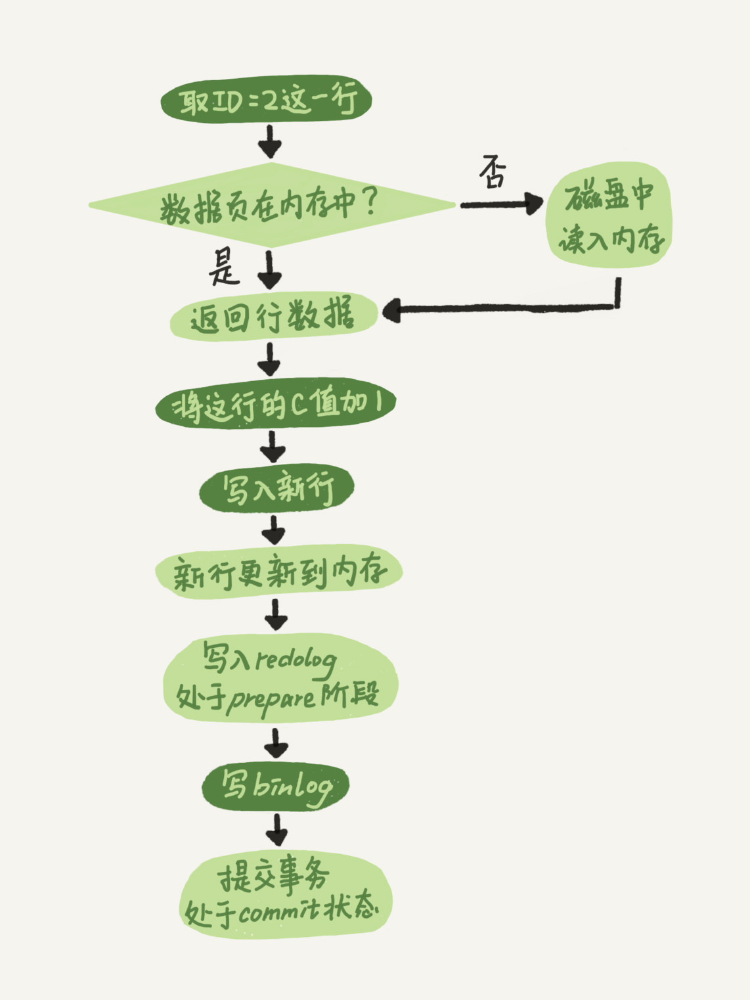
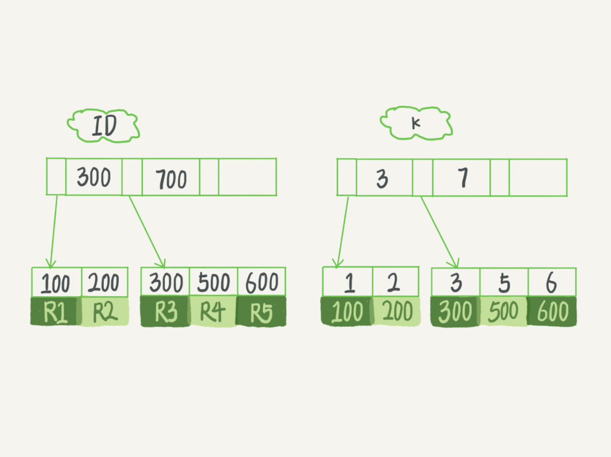
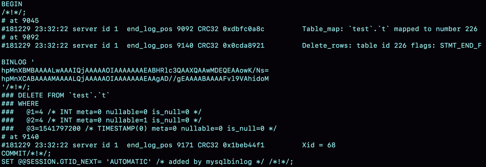
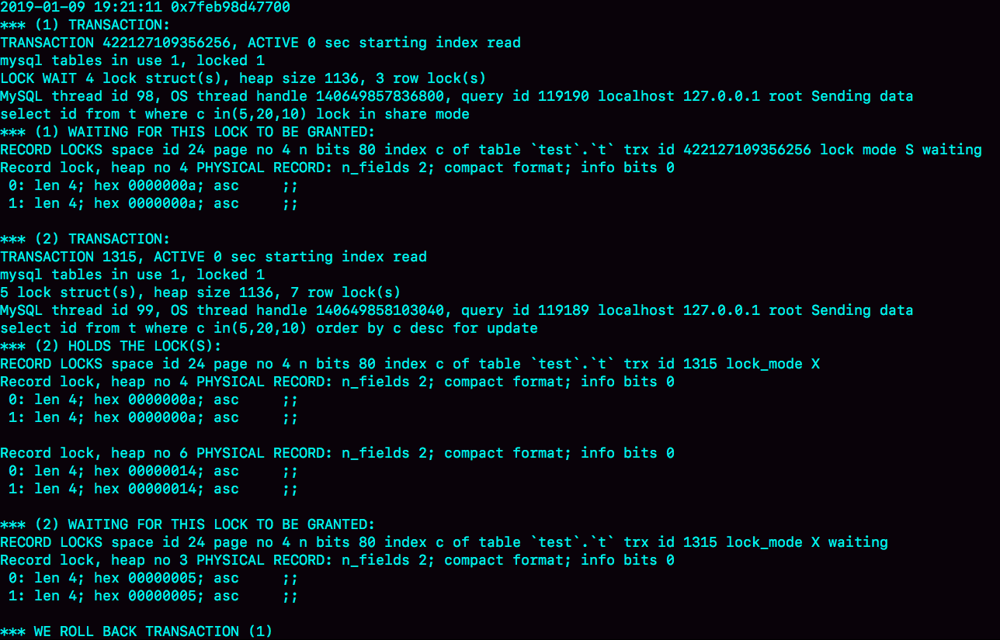
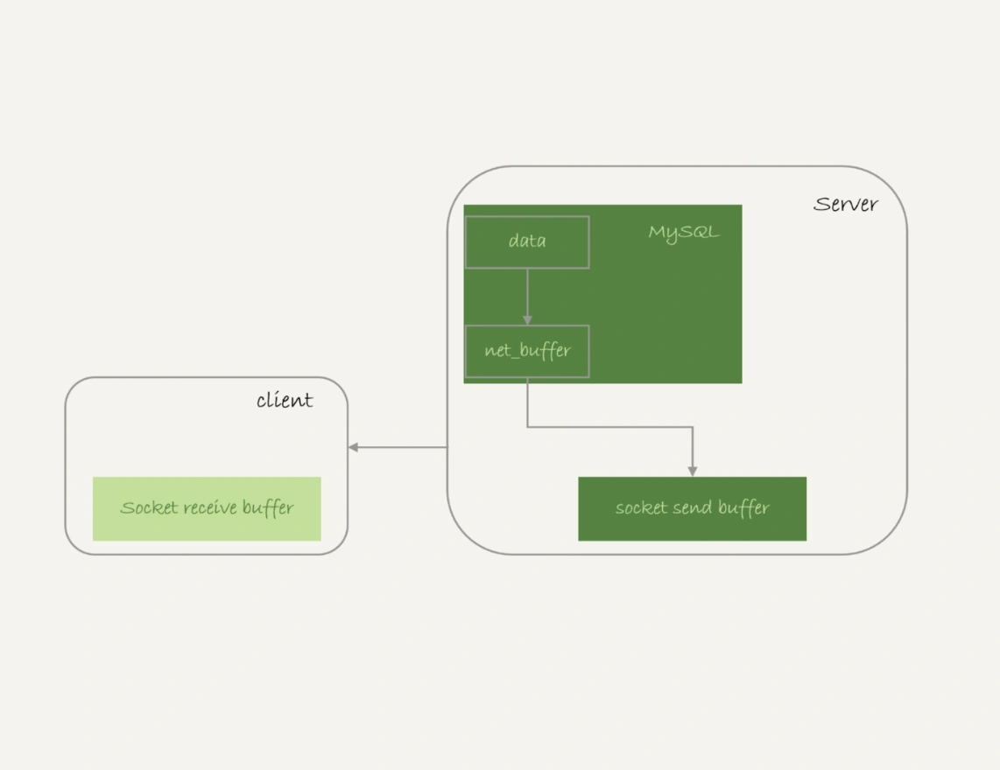

[极客时间-mysql实战45讲](https://time.geekbang.org/column/intro/100020801?tab=catalog) 

最近公众号看到歪歪大佬的安利，入坑买了个极客时间-丁奇老师的-mysql实战45讲，这里简单做个课程笔记

## sql查询语句怎么执行

`mysql> select * from T where ID=10；`


大体来说，MySQL 可以分为 Server 层和存储引擎层两部分。

Server 层包括连接器、查询缓存、分析器、优化器、执行器等，涵盖 MySQL 的大多数核心服务功能，以及所有的内置函数（如日期、时间、数学和加密函数等），所有跨存储引擎的功能都在这一层实现，比如存储过程、触发器、视图等。

而存储引擎层负责数据的存储和提取。其架构模式是插件式的，支持 InnoDB、MyISAM、Memory 等多个存储引擎。

现在最常用的存储引擎是 InnoDB，它从 MySQL 5.5.5 版本开始成为了默认存储引擎。

1. 连接器是从权限表里边查询用户权限并保存在一个变量里边以供查询缓存，分析器，执行器在检查权限的时候使用。 
2. sql执行过程中可能会有触发器这种在运行时才能确定的过程，分析器工作结束后的precheck是不能对这种运行时涉及到的表进行权限校验的，所以需要在执行器阶段进行权限检查。另外正是因为有precheck这个步骤，才会在报错时报的是用户无权，而不是 k字段不存在（为了不向用户暴露表结构）。 
3. 词法分析阶段是从information schema里面获得表的结构信息的。 
4. 可以使用连接池的方式，将短连接变为长连接。 
5. mysql_reset_connection是mysql为各个编程语言提供的api，不是sql语句。 
6. wait_timeout是非交互式连接的空闲超时，interactive_timeout是交互式连接的空闲超时。执行时间不计入空闲时间。这两个超时设置得是否一样要看情况。

7. 优化器根据sql语句选择适合的索引等，执行器循环遍历满足条件的行，然后写入结果集。

## sql更新语句怎么执行

```mysql
update T set c=c+1 where ID=2;
```

更新流程涉及到两个重要的日志模块，`redolog` 跟 `binlog`

msyql里经常说的`WAL(Write-Ahead Logging)` ，它的关键点是先写日志，再在空闲的时候写入磁盘，所以具有`crash-safe`，InnoDB引擎特有的日志引擎redolog就是根据这个原理，是物理日志，记录在某个数据页进行什么修改，循环写，空间会用完，

server层也有自己的日志模块，binlog，则是逻辑日志，追加写，会有多个文件，



redo log 用于保证 crash-safe 能力。`innodb_flush_log_at_trx_commit` 这个参数设置成 1 的时候，表示每次事务的 redo log 都直接持久化到磁盘。这个参数我建议你设置成 1，这样可以保证 MySQL 异常重启之后数据不丢失。

`sync_binlog` 这个参数设置成 1 的时候，表示每次事务的 binlog 都持久化到磁盘。这个参数我也建议你设置成 1，这样可以保证 MySQL 异常重启之后 binlog 不丢失。

## 事务隔离

ACID（Atomicity、Consistency、Isolation、Durability，即原子性、一致性、隔离性、持久性

SQL 标准的事务隔离级别包括：读未提交（read uncommitted）、读提交（read committed）、可重复读（repeatable read）和串行化（serializable ）。

1. 读未提交是指，一个事务还没提交时，它做的变更就能被别的事务看到。
2. 读提交是指，一个事务提交之后，它做的变更才会被其他事务看到。
3. 可重复读是指，一个事务执行过程中看到的数据，总是跟这个事务在启动时看到的数据是一致的。当然在可重复读隔离级别下，未提交变更对其他事务也是不可见的。
4. 串行化，顾名思义是对于同一行记录，“写”会加“写锁”，“读”会加“读锁”。当出现读写锁冲突的时候，后访问的事务必须等前一个事务执行完成，才能继续执行

在实现上，数据库里面会创建一个视图，访问的时候以视图的逻辑结果为准。在“可重复读”隔离级别下，这个视图是在事务启动时创建的，整个事务存在期间都用这个视图。在“读提交”隔离级别下，这个视图是在每个 SQL 语句开始执行的时候创建的。这里需要注意的是，“读未提交”隔离级别下直接返回记录上的最新值，没有视图概念；而“串行化”隔离级别下直接用加锁的方式来避免并行访问。

一般mysql默认的事务级别为“读未提交”，如果要改为其他隔离方式，配置的方式是，将启动参数 transaction-isolation 的值设置成 READ-COMMITTED。你可以用 show variables 来查看当前的值

事务的实现方式是基于数据库的多版本并发控制`MVCC`，回滚日志使得每个事务对应各自的`read-view`，

建议你总是使用 set autocommit=1, 通过显式语句的方式来启动事务

你可以在 information_schema 库的 innodb_trx 这个表中查询长事务，比如下面这个语句，用于查找持续时间超过 60s 的事务。
```mysql
select * from information_schema.innodb_trx where TIME_TO_SEC(timediff(now(),trx_started))>60
```

## 索引

在 InnoDB 中，表都是根据主键顺序以索引的形式存放的，这种存储方式的表称为索引组织表。又因为前面我们提到的，InnoDB 使用了 B+ 树索引模型，所以数据都是存储在 B+ 树中的。



索引类型分为`主键索引`和`非主键索引`。主键索引的叶子节点存的是整行数据。在 InnoDB 里，主键索引也被称为聚簇索引（clustered index）。非主键索引的叶子节点内容是主键的值。在 InnoDB 里，非主键索引也被称为二级索引（secondary index）。

如果语句是 select * from T where ID=500，即主键查询方式，则只需要搜索 ID 这棵 B+ 树；如果语句是 select * from T where k=5，即普通索引查询方式，则需要先搜索 k 索引树，得到 ID 的值为 500，再到 ID 索引树搜索一次。这个过程称为`回表`。

一个数据页满了，按照B+Tree算法，新增加一个数据页，叫做页分裂，会导致性能下降。空间利用率降低大概50%。当相邻的两个数据页利用率很低的时候会做数据页合并，合并的过程是分裂过程的逆过程。

如果删除，新建主键索引，会同时去修改普通索引对应的主键索引，性能消耗比较大。 删除重建普通索引貌似影响不大，不过要注意在业务低谷期操作，避免影响业务。可以使用`alter table T engine=InnoDB` 重建表索引。

1. 覆盖索引：如果查询条件使用的是普通索引（或是联合索引的最左原则字段），查询结果是联合索引的字段或是主键，不用回表操作，直接返回结果，减少IO磁盘读写读取正行数据 
2. 最左前缀：联合索引的最左 N 个字段，也可以是字符串索引的最左 M 个字符 
3. 联合索引：根据创建联合索引的顺序，以最左原则进行where检索，比如（age，name）以age=1 或 age= 1 and name=‘张三’可以使用索引，单以name=‘张三’ 不会使用索引，考虑到存储空间的问题，还请根据业务需求，将查找频繁的数据进行靠左创建索引。 
4. 索引下推：like 'hello%’and age >10 检索，MySQL5.6版本之前，会对匹配的数据进行回表查询。5.6版本后，会先过滤掉age<10的数据，再进行回表查询，减少回表率，提升检索速度

## 全局锁，表级锁

FTWRL 前有读写的话 ,FTWRL 都会等待 读写执行完毕后才执行 

FTWRL 执行的时候要刷脏页的数据到磁盘,因为要保持数据的一致性 ，理解的执行FTWRL时候是 所有事务 都提交完毕的时候 

mysqldump + -single-transaction 也是保证事务的一致性,但他只针对 有支持事务 引擎,比如 innodb 所以 还是强烈建议大家在创建实例,表时候需要innodb 引擎 为好 

全库只读 readonly = true 还有个情况在 slave 上 如果用户有超级权限的话 readonly 是失效的 

表级别 锁 ：一个直接就是表锁 lock table 建议不要使用, 影响太大，另个就是 MDL 元数据锁 MDL 是并发情况下维护数据的一致性,在表上有事务的时候,不可以对元数据经行写入操作,并且这个是在server层面实现的 当你做 dml 时候增加的 MDL 读锁, update table set id=Y where id=X; 并且由于隔离级别的原因 读锁之间不冲突 

当你DDL 时候 增加对表的写锁, 同时操作两个alter table 操作 这个要出现等待情况。 但是 如果是 dml 与ddl 之间的交互 就更容易出现不可读写情况,这个情况容易session 爆满,session是占用内存的,也会导致内存升高 MDL 释放的情况就是 事务提交. 

主库上的一个小表做了一个 DDL, 同步给slave ,由于这个时候有了先前的 single-transaction,所以slave 就会出现 该表的 锁等待, 并且slave 出现延迟

## 行级锁

两阶段锁：在 InnoDB 事务中，行锁是在需要的时候才加上的，但并不是不需要了就立刻释放， 而是要等到事务结束时才释放。

建议：如果你的事务中需要锁多个行，要把最可能造成锁冲突、最可能影响并发度的锁尽量往后放。 

死锁：当并发系统中不同线程出现循环资源依赖，涉及的线程都在等待别的线程释放资源时，就会导致这几个线程都进入无限等待的状态。

解决方案： 
1. 通过参数 innodb_lock_wait_timeout 根据实际业务场景来设置超时时间，InnoDB引擎默认值是50s。 
2. 发起死锁检测，发现死锁后，主动回滚死锁链条中的某一个事务，让其他事务得以继续执行。将参数 innodb_deadlock_detect 设置为 on，表示开启这个逻辑（默认是开启状态）。 
3. 如何解决热点行更新导致的性能问题？ 1、如果你能确保这个业务一定不会出现死锁，可以临时把死锁检测关闭掉。一般不建议采用 2、控制并发度，对应相同行的更新，在进入引擎之前排队。这样在InnoDB内部就不会有大量的死锁检测工作了。3、将热更新的行数据拆分成逻辑上的多行来减少锁冲突，但是业务复杂度可能会大大提高。 innodb行级锁是通过锁索引记录实现的，如果更新的列没建索引是会锁住整个表的

## 事务隔离跟锁

1. innodb支持RC和RR隔离级别实现是用的一致性视图(consistent read view)
2. 事务在启动时会拍一个快照,这个快照是基于整个库的. 基于整个库的意思就是说一个事务内,整个库的修改对于该事务都是不可见的(对于快照读的情况) 如果在事务内select t表,另外的事务执行了DDL t表,根据发生时间,要嘛锁住要嘛报错(参考第六章) 
3. 事务是如何实现的MVCC呢? (1)每个事务都有一个事务ID,叫做transaction id(严格递增) (2)事务在启动时,找到已提交的最大事务ID记为up_limit_id。 (3)事务在更新一条语句时,比如id=1改为了id=2.会把id=1和该行之前的row trx_id写到undo log里, 并且在数据页上把id的值改为2,并且把修改这条语句的transaction id记在该行行头 (4)再定一个规矩,一个事务要查看一条数据时,必须先用该事务的up_limit_id与该行的transaction id做比对, 如果up_limit_id>=transaction id,那么可以看.如果up_limit_id<transaction id,则只能去undo log里去取。去undo log查找数据的时候,也需要做比对,必须up_limit_id>transaction id,才返回数据 
4. 什么是当前读,由于当前读都是先读后写,只能读当前的值,所以为当前读.会更新事务内的up_limit_id为该事务的transaction id 
5. 为什么rr能实现可重复读而rc不能,分两种情况 (1)快照读的情况下,rr不能更新事务内的up_limit_id, 而rc每次会把up_limit_id更新为快照读之前最新已提交事务的transaction id,则rc不能可重复读 (2)当前读的情况下,rr是利用record lock+gap lock来实现的,而rc没有gap,所以rc不能可重复读

## 普通索引 vs 唯一索引

对于查询过程来说： 
a、普通索引，查到满足条件的第一个记录后，继续查找下一个记录，知道第一个不满足条件的记录 
b、唯一索引，由于索引唯一性，查到第一个满足条件的记录后，停止检索 但是，两者的性能差距微乎其微。因为InnoDB根据数据页来读写的。 

对于更新过程来说： 概念：change buffer 当需要更新一个数据页，如果数据页在内存中就直接更新，如果不在内存中，在不影响数据一致性的前提下，InnoDB会将这些更新操作缓存在change buffer中。下次查询需要访问这个数据页的时候，将数据页读入内存，然后执行change buffer中的与这个页有关的操作。

change buffer是可以持久化的数据。在内存中有拷贝，也会被写入到磁盘上 

purge:将change buffer中的操作应用到原数据页上，得到最新结果的过程，成为purge 访问这个数据页会触发purge，系统有后台线程定期purge，在数据库正常关闭的过程中，也会执行purge 

唯一索引的更新不能使用change buffer change buffer用的是buffer pool里的内存，change buffer的大小，可以通过参数innodb_change_buffer_max_size来动态设置。这个参数设置为50的时候，表示change buffer的大小最多只能占用buffer pool的50%。 将数据从磁盘读入内存涉及随机IO的访问，是数据库里面成本最高的操作之一。 

change buffer 因为减少了随机磁盘访问，所以对更新性能的提升很明显。 change buffer使用场景 在一个数据页做purge之前，change buffer记录的变更越多，收益就越大。 对于写多读少的业务来说，页面在写完以后马上被访问到的概率比较小，此时change buffer的使用效果最好。这种业务模型常见的就是账单类、日志类的系统。 反过来，假设一个业务的更新模式是写入之后马上会做查询，那么即使满足了条件，将更新先记录在change buffer,但之后由于马上要访问这个数据页，会立即触发purge过程。 这样随机访问IO的次数不会减少，反而增加了change buffer的维护代价。所以，对于这种业务模式来说，change buffer反而起到了副作用。 

索引的选择和实践： 尽可能使用普通索引。 redo log主要节省的是随机写磁盘的IO消耗(转成顺序写)，而change buffer主要节省的则是随机读磁盘的IO消耗。 

思考题： change buffer不会丢失，因为change buffer是可以持久化的数据，在磁盘上占据了系统表空间ibdata，对应的内部系统表名为SYS_IBUF_TABLE。因此在异常关机的时候，不会丢失。

## 字符串加索引

1. 直接创建完整索引，这样可能比较占用空间；
2. 创建前缀索引，节省空间，但会增加查询扫描次数，并且不能使用覆盖索引；
3. 倒序存储，再创建前缀索引，用于绕过字符串本身前缀的区分度不够的问题；
4. 创建 hash 字段索引，查询性能稳定，有额外的存储和计算消耗，跟第三种方式一样，都不支持范围扫描。

## 抖一下

1. MySQL抖一下是什么意思？ 抖我认为就是不稳定的意思，一个SQL语句平时速度都挺快的，偶尔会慢一下且没啥规律，就是抖啦！
2. MySQL为啥会抖一下？ 因为运行的不正常了，或者不稳定了，需要花费更多的资源处理别的事情，会使SQL语句的执行效率明显变慢。针对innoDB导致MySQL抖的原因，主要是InnoDB 会在后台刷脏页，而刷脏页的过程是要将内存页写入磁盘。所以，无论是你的查询语句在需要内存的时候可能要求淘汰一个脏页，还是由于刷脏页的逻辑会占用 IO 资源并可能影响到了你的更新语句，都可能是造成你从业务端感知MySQL“抖”了一下的原因。 
3. MySQL抖一下有啥问题？ 很明显系统不稳定，性能突然下降对业务端是很不友好的。 
4. 怎么让MySQL不抖？ 设置合理参数配配置，尤其是设置 好innodb_io_capacity 的值，并且平时要多关注脏页比例，不要让它经常接近 75% 
5. 啥是脏页？ 当内存数据页跟磁盘数据页内容不一致的时候，我们称这个内存页为“脏页”。 按照这个定义感觉脏页是不可避免的，写的时候总会先写内存再写磁盘和有没有用WAL没啥关系？ 
6. 啥是干净页？ 内存数据写入到磁盘后，内存和磁盘上的数据页的内容就一致了，称为“干净页”。 
7. 脏页是咋产生的？ 因为使用了WAL技术，这个技术会把数据库的随机写转化为顺序写，但副作用就是会产生脏页。 
8. 啥是随机写？为啥那么耗性能？ 随机写我的理解是，这次写磁盘的那个扇区和上一次没啥关系，需要重新定位位置，机械运动是很慢的即使不是机械运动重新定位写磁盘的位置也是很耗时的。 
9. 啥是顺序写？ 顺序写我的理解是，这次写磁盘那个扇区就在上一次的下一个位置，不需要重新定位写磁盘的位置速度当然会快一些。 
10. WAL怎么把随机写转化为顺序写的？ 写redolog是顺序写的，先写redolog等合适的时候再写磁盘，间接的将随机写变成了顺序写，性能确实会提高不少。

## 表数据删掉一半，表文件大小不变

1. delete操作会生成插入相同记录的记录复用和page复用 
2. delete会产生page空洞，随机insert也会产生page空洞(页分裂)，索引update分解为delete和insert也会产生空洞 
3. 重建表可以使数据在page上更紧凑 
4. alter table tb_name engine=innodb 在非online ddl 时server层生成临时表且mdl写锁，阻塞其他会话dml操作，锁阻塞时间久。在online ddl时，时innodb引擎操作步骤： a.扫描表页，获取表的dml读锁; b.将表页复制到一个临时文件，以b+树格式存储; c.在扫描和复制page的过程生成row.log日志记录ddl复制过程的dml操作; d.将row.log操作日志应用到临时文件; e.获取dml的写锁，临时文件与表文件替换 5.ddl online时，innodb表加全文索引时，会阻塞dml操作，其实效果与非online ddl一样的。ddl online一定是inplace;inplace 的ddl不一定是online,例如:添加fulltext索引和spatial索引 6.optimize table 重建表及索引，收集统计信息 alter table tb engine=innodb 重建表其实也收集统计信息 analyze table tb 重新收集统计信息
5. 建议将 innodb_file_per_table 设置为 ON，因为，一个表单独存储为一个文件更容易管理，而且在你不需要这个表的时候，通过 drop table 命令，系统就会直接删除这个文件。而如果是放在共享表空间中，即使表删掉了，空间也是不会回收的。

## count(*) 为啥这么慢

1. count(*)、count(主键 id) 和 count(1) 都表示返回满足条件的结果集的总行数；而 count(字段），则表示返回满足条件的数据行里面，参数“字段”不为 NULL 的总个数
2. 对于 count(主键 id) 来说，InnoDB 引擎会遍历整张表，把每一行的 id 值都取出来，返回给 server 层。server 层拿到 id 后，判断是不可能为空的，就按行累加。
3. 对于 count(1) 来说，InnoDB 引擎遍历整张表，但不取值。server 层对于返回的每一行，放一个数字“1”进去，判断是不可能为空的，按行累加。单看这两个用法的差别的话，你能对比出来，count(1) 执行得要比 count(主键 id) 快。因为从引擎返回 id 会涉及到解析数据行，以及拷贝字段值的操作。
4. 对于 count(字段) 来说：如果这个“字段”是定义为 not null 的话，一行行地从记录里面读出这个字段，判断不能为 null，按行累加；如果这个“字段”定义允许为 null，那么执行的时候，判断到有可能是 null，还要把值取出来再判断一下，不是 null 才累加。也就是前面的第一条原则，server 层要什么字段，InnoDB 就返回什么字段。
5. 但是 count(*) 是例外，并不会把全部字段取出来，而是专门做了优化，不取值。count(*) 肯定不是 null，按行累加。看到这里，你一定会说，优化器就不能自己判断一下吗，主键 id 肯定非空啊，为什么不能按照 count(*) 来处理，多么简单的优化啊。当然，MySQL 专门针对这个语句进行优化，也不是不可以。但是这种需要专门优化的情况太多了，而且 MySQL 已经优化过 count(*) 了，你直接使用这种用法就可以了。
6. 所以结论是：按照效率排序的话，count(字段)<count(主键 id)<count(1)≈count(*)，所以我建议你，尽量使用 count(*)。
7. 分析这些count()的原则如下： 8-1：server 层要什么就给什么； 8-2：InnoDB 只给必要的值； 8-3：现在的优化器只优化了 count(*) 的语义为“取行数”，其他“显而易见”的优化并没有做。

## “order by”是怎么工作的？

1. MySQL会为每个线程分配一个内存（sort_buffer）用于排序该内存大小为sort_buffer_size 1>如果排序的数据量小于sort_buffer_size，排序将会在内存中完成 2>如果排序数据量很大，内存中无法存下这么多数据，则会使用磁盘临时文件来辅助排序，也称外部排序 3>在使用外部排序时，MySQL会分成好几份单独的临时文件用来存放排序后的数据，然后在将这些文件合并成一个大文件 
2. mysql会通过遍历索引将满足条件的数据读取到sort_buffer，并且按照排序字段进行快速排序 1>如果查询的字段不包含在辅助索引中，需要按照辅助索引记录的主键返回聚集索引取出所需字段 2>该方式会造成随机IO，在MySQL5.6提供了MRR的机制，会将辅助索引匹配记录的主键取出来在内存中进行排序，然后在回表 3>按照情况建立联合索引来避免排序所带来的性能损耗，允许的情况下也可以建立覆盖索引来避免回表 
3. 全字段排序 1.通过索引将所需的字段全部读取到sort_buffer中 2.按照排序字段进行排序 将结果集返回给客户端 缺点： 1.造成sort_buffer中存放不下很多数据，因为除了排序字段还存放其他字段，对sort_buffer的利用效率不高 2.当所需排序数据量很大时，会有很多的临时文件，排序性能也会很差 优点：MySQL认为内存足够大时会优先选择全字段排序，因为这种方式比rowid 排序避免了一次回表操作 
4. rowid排序 1.通过控制排序的行数据的长度来让sort_buffer中尽可能多的存放数据，max_length_for_sort_data 2.只将需要排序的字段和主键读取到sort_buffer中，并按照排序字段进行排序 3.按照排序后的顺序，取id进行回表取出想要获取的数据 4.将结果集返回给客户端 优点：更好的利用内存的sort_buffer进行排序操作，尽量减少对磁盘的访问 缺点：回表的操作是随机IO，会造成大量的随机读，不一定就比全字段排序减少对磁盘的访问 3.按照排序的结果返回客户所取行数

## order by rand()

select word from words order by rand() limit 3;

Extra 字段显示 Using temporary，表示的是需要使用临时表；Using filesort，表示的是需要执行排序操作。

1. 创建一个临时表。这个临时表使用的是 memory 引擎，表里有两个字段，第一个字段是 double 类型，为了后面描述方便，记为字段 R，第二个字段是 varchar(64) 类型，记为字段 W。并且，这个表没有建索引。
2. 从 words 表中，按主键顺序取出所有的 word 值。对于每一个 word 值，调用 rand() 函数生成一个大于 0 小于 1 的随机小数，并把这个随机小数和 word 分别存入临时表的 R 和 W 字段中，到此，扫描行数是 10000。
3. 现在临时表有 10000 行数据了，接下来你要在这个没有索引的内存临时表上，按照字段 R 排序。
4. 初始化 sort_buffer。sort_buffer 中有两个字段，一个是 double 类型，另一个是整型。
5. 从内存临时表中一行一行地取出 R 值和位置信息（我后面会和你解释这里为什么是“位置信息”），分别存入 sort_buffer 中的两个字段里。这个过程要对内存临时表做全表扫描，此时扫描行数增加 10000，变成了 20000。
6. 在 sort_buffer 中根据 R 的值进行排序。注意，这个过程没有涉及到表操作，所以不会增加扫描行数。
7. 排序完成后，取出前三个结果的位置信息，依次到内存临时表中取出 word 值，返回给客户端。这个过程中，访问了表的三行数据，总扫描行数变成了 20003

建议业务代码做处理，或者执行多条limit n,1

## 函数不走索引

1. 条件字段函数操作，对索引字段做函数操作，可能会破坏索引值的有序性，因此优化器就决定放弃走树搜索功能。
2. 隐式类型转换，在 MySQL 中，字符串和数字做比较的话，是将字符串转换成数字。所以，select * from tradelog where tradeid=110717;相当于select * from tradelog where CAST(tradid AS signed int) = 110717;不会走索引。
3. 隐式字符编码转换，字符集 utf8mb4 是 utf8 的超集，所以当这两个类型的字符串在做比较的时候，MySQL 内部的操作是，先把 utf8 字符串转成 utf8mb4 字符集，再做比较。select * from trade_detail where tradeid=L2.tradeid.value; 等价于select * from trade_detail  where CONVERT(traideid USING utf8mb4)=L2.tradeid.value; 

## 查询长时间不返回

1. 等mdl锁，`show processlist`，MySQL 启动时需要设置 performance_schema=on，相比于设置为 off 会有 10% 左右的性能损失，通过查询 sys.schema_table_lock_waits 这张表，我们就可以直接找出造成阻塞的 process id，把这个连接用 kill 命令断开即可。
2. 等flush，show processlist，
3. 等行级锁，`select * from t sys.innodb_lock_waits where locked_table='test'`


## 幻读
什么是幻读? 幻读指的是一个事务在前后两次查询同一个范围的时候，后一次查询看到了前一次查询没有看到的行。（幻读在当前读下才会出现；幻读仅专指新插入的行）

如何解决幻读? 间隙锁（Gap lock）:（两个值之间的锁）。 间隙锁和行锁合称 next-key lock，每个 next-key lock 是前开后闭区间。 间隙锁为开区间。 next-key-lock为前开后闭区间。 

间隙锁引入什么问题？ 可能会导致同样的语句锁住更大的范围，这其实是影响了并发度的。 间隙锁在RR级别下才有效，RC级别下无间隙锁。 不使用间隙锁方法: 使用读提交隔离级别+ binlog_format=row组合。

## 加锁原则

 1. 原则1：加锁的基本单位是 next-key lock。希望你还记得，next-key lock 是前开后闭区间。
 2. 原则2：查找过程中访问到的对象才会加锁。
 3. 优化1：索引上的等值查询，给唯一索引加锁的时候，next-key lock 退化为行锁。
 4. 优化 2：索引上的等值查询，向右遍历时且最后一个值不满足等值条件的时候，next-key lock 退化为间隙锁。
 5. 一个 bug：唯一索引上的范围查询会访问到不满足条件的第一个值为止

## 工具

你需要工具帮你检查所有的 SQL 语句的返回结果。比如，你可以使用开源工具 pt-query-digest(https://www.percona.com/doc/percona-toolkit/3.0

## 主备一致

建议将备库设置成只读，因为 readonly 设置对超级 (super) 权限用户是无效的，而用于同步更新的线程，就拥有超级权限。

备库 B 跟主库 A 之间维持了一个长连接。主库 A 内部有一个线程，专门用于服务备库 B 的这个长连接。一个事务日志同步的完整过程是这样的：
1. 在备库 B 上通过 change master 命令，设置主库 A 的 IP、端口、用户名、密码，以及要从哪个位置开始请求 binlog，这个位置包含文件名和日志偏移量。
2. 在备库 B 上执行 start slave 命令，这时候备库会启动两个线程，就是图中的 io_thread 和 sql_thread。其中 io_thread 负责与主库建立连接。
3. 主库 A 校验完用户名、密码后，开始按照备库 B 传过来的位置，从本地读取 binlog，发给 B。
4. 备库 B 拿到 binlog 后，写到本地文件，称为中转日志（relay log）。
5. sql_thread 读取中转日志，解析出日志里的命令，并执行。

binlog的三种格式
1. statement 记录sql语句原文，如果是delete limit的操作，可能导致主备数据不一致，
2. row 格式的 binlog 里没有了 SQL 语句的原文，而是替换成了两个 event：Table_map 和 Delete_rows。Table_map event，用于说明接下来要操作的表是 test 库的表 t;Delete_rows event，用于定义删除的行为。使用mysqlbinlog查看详细内容， mysqlbinlog -vv data/master.000001 --start-position=8900;

从这个图中，我们可以看到以下几个信息：server id 1，表示这个事务是在 server_id=1 的这个库上执行的。每个 event 都有 CRC32 的值，这是因为我把参数 binlog_checksum 设置成了 CRC32。Table_map event 跟在图 5 中看到的相同，显示了接下来要打开的表，map 到数字 226。现在我们这条 SQL 语句只操作了一张表，如果要操作多张表呢？每个表都有一个对应的 Table_map event、都会 map 到一个单独的数字，用于区分对不同表的操作。我们在 mysqlbinlog 的命令中，使用了 -vv 参数是为了把内容都解析出来，所以从结果里面可以看到各个字段的值（比如，@1=4、 @2=4 这些值）。binlog_row_image 的默认配置是 FULL，因此 Delete_event 里面，包含了删掉的行的所有字段的值。如果把 binlog_row_image 设置为 MINIMAL，则只会记录必要的信息，在这个例子里，就是只会记录 id=4 这个信息。最后的 Xid event，用于表示事务被正确地提交了。你可以看到，当 binlog_format 使用 row 格式的时候，binlog 里面记录了真实删除行的主键 id，这样 binlog 传到备库去的时候，就肯定会删除 id=4 的行，不会有主备删除不同行的问题。
3. mixed，row太占空间，比如你用一个 delete 语句删掉 10 万行数据，用 statement 的话就是一个 SQL 语句被记录到 binlog 中，占用几十个字节的空间。但如果用 row 格式的 binlog，就要把这 10 万条记录都写到 binlog 中。这样做，不仅会占用更大的空间，同时写 binlog 也要耗费 IO 资源，影响执行速度。。MySQL 就取了个折中方案，也就是有了 mixed 格式的 binlog。mixed 格式的意思是，MySQL 自己会判断这条 SQL 语句是否可能引起主备不一致，如果有可能，就用 row 格式，否则就用 statement 格式。

原来 binlog 在记录 event 的时候，多记了一条命令：SET TIMESTAMP=1546103491。它用 SET TIMESTAMP 命令约定了接下来的 now() 函数的返回时间。
用 binlog 来恢复数据的标准做法是，用 mysqlbinlog 工具解析出来，然后把解析结果整个发给 MySQL 执行。类似下面的命令：
mysqlbinlog master.000001  --start-position=2738 --stop-position=2973 | mysql -h127.0.0.1 -P13000 -uuser -ppwd;

## 怎么看死锁

执行 `show engine innodb status` 命令得到的部分输出。这个命令会输出很多信息，有一节 LATESTDETECTED DEADLOCK，就是记录的最后一次死锁信息。



1. 这个结果分成三部分：(1) TRANSACTION，是第一个事务的信息；(2) TRANSACTION，是第二个事务的信息；WE ROLL BACK TRANSACTION (1)，是最终的处理结果，表示回滚了第一个事务。
2. 第一个事务的信息中：WAITING FOR THIS LOCK TO BE GRANTED，表示的是这个事务在等待的锁信息；index c of table `test`.`t`，说明在等的是表 t 的索引 c 上面的锁；lock mode S waiting 表示这个语句要自己加一个读锁，当前的状态是等待中；Record lock 说明这是一个记录锁；n_fields 2 表示这个记录是两列，也就是字段 c 和主键字段 id；0: len 4; hex 0000000a; asc ;; 是第一个字段，也就是 c。值是十六进制 a，也就是 10；1: len 4; hex 0000000a; asc ;; 是第二个字段，也就是主键 id，值也是 10；这两行里面的 asc 表示的是，接下来要打印出值里面的“可打印字符”，但 10 不是可打印字符，因此就显示空格。第一个事务信息就只显示出了等锁的状态，在等待 (c=10,id=10) 这一行的锁。当然你是知道的，既然出现死锁了，就表示这个事务也占有别的锁，但是没有显示出来。别着急，我们从第二个事务的信息中推导出来。
3.·-= 第二个事务显示的信息要多一些：“ HOLDS THE LOCK(S)”用来显示这个事务持有哪些锁；index c of table `test`.`t` 表示锁是在表 t 的索引 c 上；hex 0000000a 和 hex 00000014 表示这个事务持有 c=10 和 c=20 这两个记录锁；WAITING FOR THIS LOCK TO BE GRANTED，表示在等 (c=5,id=5) 这个记录锁。从上面这些信息中，我们就知道：“lock in share mode”的这条语句，持有 c=5 的记录锁，在等 c=10 的锁；“for update”这个语句，持有 c=20 和 c=10 的记录锁，在等 c=5 的记录锁。因此导致了死锁。这里，我们可以得到两个结论：由于锁是一个个加的，要避免死锁，对同一组资源，要按照尽量相同的顺序访问；在发生死锁的时刻，for update 这条，回滚成本更大，所以 InnoDB 选择了回滚成本更小的 lock in share mode 语句，来回滚。

lock_mode X waiting表示next-key lock； lock_mode X locks rec but not gap是只有行锁； 还有一种 “locks gap before rec”，就是只有间隙锁；

## 误删数据

1. 使用 delete 语句误删数据行：可以用 Flashback 工具通过闪回把数据恢复回来。Flashback 恢复数据的原理，是修改 binlog 的内容，拿回原库重放。而能够使用这个方案的前提是，需要确保 binlog_format=row 和 binlog_row_image=FULL。或者美团的myflash,也是一个不错的工具，本质都差不多.都是先解析binlog event,然后在进行反转。把delete反转为insert,insert反转为delete,update前后image对调。所以必须设置binlog_format=row 和 binlog_row_image=full. 切记恢复数据的时候,应该先恢复到临时的实例,然后在恢复回主库上。建议，把 sql_safe_updates 参数设置为 on。这样一来，如果我们忘记在 delete 或者 update 语句中写 where 条件，或者 where 条件里面没有包含索引字段的话，这条语句的执行就会报错。代码上线前，必须经过 SQL 审计。
2. 使用 drop table 或者 truncate table 语句误删数据表：这种情况下，要想恢复数据，就需要使用全量备份，加增量日志的方式了。这个方案要求线上有定期的全量备份，并且实时备份 binlog。把这个数据恢复功能做成自动化工具，并且经常拿出来演练。建议账号分权限管理，drop前先改表，带有deleted后缀，运行一段时间没问题再删除。
3. drop database 或者使用 rm 命令误删整个 MySQL 实例：只是删掉了其中某一个节点的数据的话，HA 系统就会开始工作，选出一个新的主库，从而保证整个集群的正常工作。要做的就是在这个节点上把数据恢复回来，再接入整个集群。建议尽量把你的备份跨机房，或者最好是跨城市保存。

## kill不掉数据

这些“kill 不掉”的情况，其实是因为发送 kill 命令的客户端，并没有强行停止目标线程的执行，而只是设置了个状态，并唤醒对应的线程。而被 kill 的线程，需要执行到判断状态的“埋点”，才会开始进入终止逻辑阶段。并且，终止逻辑本身也是需要耗费时间的。所以，如果你发现一个线程处于 Killed 状态，你可以做的事情就是，通过影响系统环境，让这个 Killed 状态尽快结束。比如，如果是第一个例子里 InnoDB 并发度的问题，你就可以临时调大 innodb_thread_concurrency 的值，或者停掉别的线程，让出位子给这个线程执行。而如果是回滚逻辑由于受到 IO 资源限制执行得比较慢，就通过减少系统压力让它加速。做完这些操作后，其实你已经没有办法再对它做什么了，只能等待流程自己完成。

## 全表扫描对server层的影响

服务端并不需要保存一个完整的结果集。取数据和发数据的流程是这样的：



1. 获取一行，写到 net_buffer 中。这块内存的大小是由参数 net_buffer_length 定义的，默认是 16k。
2. 重复获取行，直到 net_buffer 写满，调用网络接口发出去。
3. 如果发送成功，就清空 net_buffer，然后继续取下一行，并写入 net_buffer。
4. 如果发送函数返回 EAGAIN 或 WSAEWOULDBLOCK，就表示本地网络栈（socket send buffer）写满了，进入等待。直到网络栈重新可写，再继续发送。

MySQL 是“边读边发的”，这个概念很重要。这就意味着，如果客户端接收得慢，会导致 MySQL 服务端由于结果发不出去，这个事务的执行时间变长。

对于正常的线上业务来说，如果一个查询的返回结果不会很多的话，我都建议你使用 mysql_store_result 这个接口，直接把查询结果保存到本地内存。当然前提是查询返回结果不多。在第 30 篇文章评论区，有同学说到自己因为执行了一个大查询导致客户端占用内存近 20G，这种情况下就需要改用 mysql_use_result 接口了

## 全表扫描对InnoDB引擎的影响

执行 show engine innodb status ，可以看到“Buffer pool hit rate”字样，显示的就是当前的内存命中率，要保证响应时间符合要求的话，内存命中率要在 99% 以上。

对于 InnoDB 引擎内部，由于有淘汰策略，大查询也不会导致内存暴涨。并且，由于 InnoDB 对 LRU 算法做了改进，冷数据的全表扫描，对 Buffer Pool 的影响也能做到可控。当然，我们前面文章有说过，全表扫描还是比较耗费 IO 资源的，所以业务高峰期还是不能直接在线上主库执行全表扫描的。

## join

问题1，要不要使用join

问题2，怎么选驱动表

```msyql
CREATE TABLE `t2` (  `id` int(11) NOT NULL,  `a` int(11) DEFAULT NULL,  `b` int(11) DEFAULT NULL,  PRIMARY KEY (`id`),  KEY `a` (`a`)) ENGINE=InnoDB;
```

**Index Nested-Loop Join(NLJ)**
```msyql
select * from t1 straight_join t2 on (t1.a=t2.a);
```

在这个语句里，t1 是驱动表，t2 是被驱动表。执行流程，从表 t1 中读入一行数据 R；从数据行 R 中，取出 a 字段到表 t2 里去查找；取出表 t2 中满足条件的行，跟 R 组成一行，作为结果集的一部分；重复执行步骤 1 到 3，直到表 t1 的末尾循环结束。

对驱动表 t1 做了全表扫描，这个过程需要扫描 100 行；而对于每一行 R，根据 a 字段去表 t2 查找，走的是树搜索过程。由于我们构造的数据都是一一对应的，因此每次的搜索过程都只扫描一行，也是总共扫描 100 行；所以，整个执行流程，总扫描行数是 200。

在这个 join 语句执行过程中，驱动表是走全表扫描，而被驱动表是走树搜索。假设被驱动表的行数是 M。每次在被驱动表查一行数据，要先搜索索引 a，再搜索主键索引。每次搜索一棵树近似复杂度是以 2 为底的 M 的对数，记为 log2M，所以在被驱动表上查一行的时间复杂度是 2*log2M

假设驱动表的行数是 N，执行过程就要扫描驱动表 N 行，然后对于每一行，到被驱动表上匹配一次。因此整个执行过程，近似复杂度是 N + N*2*log2M。

显然，N 对扫描行数的影响更大，因此应该让小表来做驱动表。

所以，使用 join 语句，性能比强行拆成多个单表执行 SQL 语句的性能要好；如果使用 join 语句的话，需要让小表做驱动表。这个结论的前提是，“可以使用被驱动表的索引”

**Simple Nested-Loop Join**

```mysql
select * from t1 straight_join t2 on (t1.a=t2.b);
```

由于表 t2 的字段 b 上没有索引，因此再用图 2 的执行流程时，每次到 t2 去匹配的时候，就要做一次全表扫描。

这样算来，这个 SQL 请求就要扫描表 t2 多达 100 次，总共扫描 100*1000=10 万行。

这还只是两个小表，如果 t1 和 t2 都是 10 万行的表（当然了，这也还是属于小表的范围），就要扫描 100 亿行，这个算法看上去太“笨重”了，

**Block Nested-Loop Join(BNL)**

mysql使用这种算法，被驱动表上没有可用的索引，算法的流程是这样的：把表 t1 的数据读入线程内存 join_buffer 中，由于我们这个语句中写的是 select *，因此是把整个表 t1 放入了内存；扫描表 t2，把表 t2 中的每一行取出来，跟 join_buffer 中的数据做对比，满足 join 条件的，作为结果集的一部分返回。

可以看到，在这个过程中，对表 t1 和 t2 都做了一次全表扫描，因此总的扫描行数是 1100。由于 join_buffer 是以无序数组的方式组织的，因此对表 t2 中的每一行，都要做 100 次判断，总共需要在内存中做的判断次数是：100乘以1000=10 万次。前面我们说过，如果使用 Simple Nested-Loop Join 算法进行查询，扫描行数也是 10 万行。因此，从时间复杂度上来说，这两个算法是一样的。但是，Block Nested-Loop Join 算法的这 10 万次判断是内存操作，速度上会快很多，性能也更好。

假设小表的行数是 N，大表的行数是 M，那么在这个算法里：两个表都做一次全表扫描，所以总的扫描行数是 M+N；内存中的判断次数是 M乘以N。调换这两个算式中的 M 和 N 没差别，因此这时候选择大表还是小表做驱动表，执行耗时是一样的。

要是表 t1 是一个大表，join_buffer 放不下怎么办呢？join_buffer 的大小是由参数 join_buffer_size 设定的，默认值是 256k。如果放不下表 t1 的所有数据话，策略很简单，就是分段放。

扫描行数是 N+λ*N*M；内存判断 N乘以M 次。显然，内存判断次数是不受选择哪个表作为驱动表影响的。而考虑到扫描行数，在 M 和 N 大小确定的情况下，N 小一些，整个算式的结果会更小。所以结论是，应该让小表当驱动表。这也是为什么有人会建议，如果你的 join 语句很慢，就把 join_buffer_size 改大。

**小结-能不能使用join**

如果可以使用 Index Nested-Loop Join 算法，也就是说可以用上被驱动表上的索引，其实是没问题的；如果使用 Block Nested-Loop Join 算法，扫描行数就会过多。尤其是在大表上的 join 操作，这样可能要扫描被驱动表很多次，会占用大量的系统资源。所以这种 join 尽量不要用。所以你在判断要不要使用 join 语句时，就是看 explain 结果里面，Extra 字段里面有没有出现“Block Nested Loop”字样。

**小结-怎么选驱动表**

如果是 Index Nested-Loop Join 算法，应该选择小表做驱动表；如果是 Block Nested-Loop Join 算法：在 join_buffer_size 足够大的时候，是一样的；在 join_buffer_size 不够大的时候（这种情况更常见），应该选择小表做驱动表。所以，这个问题的结论就是，总是应该使用小表做驱动表。

注意，小表，是要带条件进去的，而不是全表的数量，在决定哪个表做驱动表的时候，应该是两个表按照各自的条件过滤，过滤完成之后，计算参与 join 的各个字段的总数据量，数据量小的那个表，就是“小表”，应该作为驱动表。

**优化**

在这些优化方法中：BKA 优化是 MySQL 已经内置支持的，建议你默认使用；BNL 算法效率低，建议你都尽量转成 BKA 算法。优化的方向就是给被驱动表的关联字段加上索引；基于临时表的改进方案，对于能够提前过滤出小数据的 join 语句来说，效果还是很好的；MySQL 目前的版本还不支持 hash join（8.0已经支持），但你可以配合应用端自己模拟出来，理论上效果要好于临时表的方案。

## 临时表

```mysql
create temporary table temp_t like t1;
```

由于临时表只能被创建它的 session 访问，所以在这个 session 结束的时候，会自动删除临时表。也正是由于这个特性，临时表就特别适合我们文章开头的 join 优化这种场景。不同 session 的临时表是可以重名的，如果有多个 session 同时执行 join 优化，不需要担心表名重复导致建表失败的问题。不需要担心数据删除问题。如果使用普通表，在流程执行过程中客户端发生了异常断开，或者数据库发生异常重启，还需要专门来清理中间过程中生成的数据表。而临时表由于会自动回收，所以不需要这个额外的操作。

临时表一般用于处理比较复杂的计算逻辑。由于临时表是每个线程自己可见的，所以不需要考虑多个线程执行同一个处理逻辑时，临时表的重名问题。在线程退出的时候，临时表也能自动删除，省去了收尾和异常处理的工作。在 binlog_format='row’的时候，临时表的操作不记录到 binlog 中，也省去了不少麻烦，这也可以成为你选择 binlog_format 时的一个考虑因素。

## 内部临时表

union

```mysql
(select 1000 as f) union (select id from t1 order by id desc limit 2);

1,PRIMARY,,,,,,,,,,No tables used
2,UNION,t1,,index,,PRIMARY,4,,2,100,Using index
,UNION RESULT,"<union1,2>",,ALL,,,,,,,Using temporary

```

group by

```mysql
select id%10 as m, count(*) as c from t1 group by m;

1,SIMPLE,t1,,index,"PRIMARY,a",a,5,,100,100,Using index; Using temporary; Using filesort
```

不论是使用内存临时表还是磁盘临时表，group by 逻辑都需要构造一个带唯一索引的表，执行代价都是比较高的

group by 的语义逻辑，是统计不同的值出现的个数。但是，由于每一行的 id%100 的结果是无序的，所以我们就需要有一个临时表，来记录并统计结果。

group by 优化 -- 索引

如果可以确保输入的数据是有序的，那么计算 group by 的时候，就只需要从左到右，顺序扫描，依次累加

你一定想到了，InnoDB 的索引，就可以满足这个输入有序的条件。

在 MySQL 5.7 版本支持了 generated column 机制，用来实现列数据的关联更新。你可以用下面的方法创建一个列 z，然后在 z 列上创建一个索引（如果是 MySQL 5.6 及之前的版本，你也可以创建普通列和索引，来解决这个问题）。`alter table t1 add column z int generated always as(id % 100), add index(z);`这样，索引 z 上的数据就是类似图 10 这样有序的了。上面的 group by 语句就可以改成：`select z, count(*) as c from t1 group by z;`

group by 优化 -- 直接排序

在 group by 语句中加入 SQL_BIG_RESULT 这个提示（hint），就可以告诉优化器：这个语句涉及的数据量很大，请直接用磁盘临时表。

```mysql
select SQL_BIG_RESULT id%100 as m, count(*) as c from t1 group by m;
```

MySQL 什么时候会使用内部临时表？

1. 如果语句执行过程可以一边读数据，一边直接得到结果，是不需要额外内存的，否则就需要额外的内存，来保存中间结果；
2. join_buffer 是无序数组，sort_buffer 是有序数组，临时表是二维表结构；
3. 如果执行逻辑需要用到二维表特性，就会优先考虑使用临时表。比如我们的例子中，union 需要用到唯一索引约束， group by 还需要用到另外一个字段来存累积计数。小结

通过今天这篇文章，我重点和你讲了 group by 的几种实现算法，从中可以总结一些使用的指导原则：
1. 如果对 group by 语句的结果没有排序要求，要在语句后面加 order by null；
2. 尽量让 group by 过程用上表的索引，确认方法是 explain 结果里没有 Using temporary 和 Using filesort；
3. 如果 group by 需要统计的数据量不大，尽量只使用内存临时表；也可以通过适当调大 tmp_table_size 参数，来避免用到磁盘临时表；
4. 如果数据量实在太大，使用 SQL_BIG_RESULT 这个提示，来告诉优化器直接使用排序算法得到 group by 的结果。

## Memory引擎

可见，InnoDB 和 Memory 引擎的数据组织方式是不同的：InnoDB 引擎把数据放在主键索引上，其他索引上保存的是主键 id。这种方式，我们称之为索引组织表（Index Organizied Table）。而 Memory 引擎采用的是把数据单独存放，索引上保存数据位置的数据组织形式，我们称之为堆组织表（Heap Organizied Table）。

从中我们可以看出，这两个引擎的一些典型不同：
1. InnoDB 表的数据总是有序存放的，而内存表的数据就是按照写入顺序存放的；
2. 当数据文件有空洞的时候，InnoDB 表在插入新数据的时候，为了保证数据有序性，只能在固定的位置写入新值，而内存表找到空位就可以插入新值；
3. 数据位置发生变化的时候，InnoDB 表只需要修改主键索引，而内存表需要修改所有索引；
4. InnoDB 表用主键索引查询时需要走一次索引查找，用普通索引查询的时候，需要走两次索引查找。而内存表没有这个区别，所有索引的“地位”都是相同的。
5. InnoDB 支持变长数据类型，不同记录的长度可能不同；内存表不支持 Blob 和 Text 字段，并且即使定义了 varchar(N)，实际也当作 char(N)，也就是固定长度字符串来存储，因此内存表的每行数据长度相同。

内存表不支持行锁，只支持表锁。因此，一张表只要有更新，就会堵住其他所有在这个表上的读写操作。

## 自增主键不连续

可见，唯一键冲突是导致自增主键 id 不连续的第一种原因。同样地，事务回滚也会产生类似的现象，这就是第二种原因。自增主键的批量申请是第三种原因。

保存机制：不同的存储引擎不一样。 MyISAM 引擎的自增值保存在数据文件中。 InnoDB 引擎的自增值，先是保存在了内存里，到了 MySQL 8.0 版本后，才有了“自增值持久化”的能力，放在了redolog里。

修改机制： 在 MySQL 里面，如果字段 id 被定义为 AUTO_INCREMENT，在插入一行数据的时候，自增值的行为如下： 1：如果插入数据时 id 字段指定为 0、null 或未指定值，那么就把这个表当前的 AUTO_INCREMENT 值填到自增字段； 2：如果插入数据时 id 字段指定了具体的值，就直接使用语句里指定的值。 

根据要插入的值和当前自增值的大小关系，自增值的变更结果也会有所不同。假设，某次要插入的值是 X，当前的自增值是 Y。 1：如果 X<Y，那么这个表的自增值不变； 2：如果 X≥Y，就需要把当前自增值修改为新的自增值。

## insert语句锁

1. 我提到 MySQL 对自增主键锁做了优化，尽量在申请到自增 id 以后，就释放自增锁。
2. insert … select 是很常见的在两个表之间拷贝数据的方法。你需要注意，在可重复读隔离级别下，这个语句会给 select 的表里扫描到的记录和间隙加读锁。
3. 而如果 insert 和 select 的对象是同一个表，则有可能会造成循环写入。这种情况下，我们需要引入用户临时表来做优化。
4. insert 语句如果出现唯一键冲突，会在冲突的唯一值上加共享的 next-key lock(S 锁)。因此，碰到由于唯一键约束导致报错后，要尽快提交或回滚事务，避免加锁时间过长。
5. insert into … on duplicate key update 这个语义的逻辑是，插入一行数据，如果碰到唯一键约束，就执行后面的更新语句。注意，如果有多个列违反了唯一性约束，就会按照索引的顺序，修改跟第一个索引冲突的行。

## 快速复制一张表

1. 物理拷贝的方式速度最快，尤其对于大表拷贝来说是最快的方法。如果出现误删表的情况，用备份恢复出误删之前的临时库，然后再把临时库中的表拷贝到生产库上，是恢复数据最快的方法。但是，这种方法的使用也有一定的局限性：必须是全表拷贝，不能只拷贝部分数据；需要到服务器上拷贝数据，在用户无法登录数据库主机的场景下无法使用；由于是通过拷贝物理文件实现的，源表和目标表都是使用 InnoDB 引擎时才能使用。
2. 用 mysqldump 生成包含 INSERT 语句文件的方法，可以在 where 参数增加过滤条件，来实现只导出部分数据。这个方式的不足之一是，不能使用 join 这种比较复杂的 where 条件写法。`mysqldump -hhost -Pport -uuser --add-locks=0 --no-create-info --single-transaction  --set-gtid-purged=OFF db1 t --where="a>900" --result-file=/client_tmp/t.sql`
	–single-transaction 的作用是，在导出数据的时候不需要对表 db1.t 加表锁，而是使用 START TRANSACTION WITH CONSISTENT SNAPSHOT 的方法；–add-locks 设置为 0，表示在输出的文件结果里，不增加" LOCK TABLES t WRITE;" ；–no-create-info 的意思是，不需要导出表结构；–set-gtid-purged=off 表示的是，不输出跟 GTID 相关的信息；–result-file 指定了输出文件的路径，其中 client 表示生成的文件是在客户端机器上的
	`mysql -h127.0.0.1 -P13000  -uroot db2 -e "source /client_tmp/t.sql"`
3. 用 select … into outfile 的方法是最灵活的，支持所有的 SQL 写法。但，这个方法的缺点之一就是，每次只能导出一张表的数据，而且表结构也需要另外的语句单独备份。后两种方式都是逻辑备份方式，是可以跨引擎使用的。`select * from db1.t where a>900 into outfile '/server_tmp/t.csv';`

## grant 和 flush privileges

今天这篇文章，我和你介绍了 MySQL 用户权限在数据表和内存中的存在形式，以及 grant 和 revoke 命令的执行逻辑。

1. grant 语句会同时修改数据表和内存，判断权限的时候使用的是内存数据。因此，规范地使用 grant 和 revoke 语句，是不需要随后加上 flush privileges 语句的。
2. flush privileges 语句本身会用数据表的数据重建一份内存权限数据，所以在权限数据可能存在不一致的情况下再使用。而这种不一致往往是由于直接用 DML 语句操作系统权限表导致的，所以我们尽量不要使用这类语句。
3. 另外，在使用 grant 语句赋权时，你可能还会看到这样的写法：grant super on *.* to 'ua'@'%' identified by 'pa';这条命令加了 identified by ‘密码’， 语句的逻辑里面除了赋权外，还包含了：如果用户’ua’@’%'不存在，就创建这个用户，密码是 pa；如果用户 ua 已经存在，就将密码修改成 pa。这也是一种不建议的写法，因为这种写法很容易就会不慎把密码给改了。
4. “grant 之后随手加 flush privileges”，我自己是这么使用了两三年之后，在看代码的时候才发现其实并不需要这样做，那已经是 2011 年的事情了。
5. 在命令行查询数据需要行转列的时候习惯加个\G ; 比如slave slave stauts \G ; 后来发现 ; 是多余的。列几个常用的 \G 行转列并发送给 mysql server \g 等同于 ; \! 执行系统命令 \q exit \c 清除当前SQL（不执行） \s mysql status 信息 其他参考 \h

## 分区表

```mysql
CREATE TABLE `t` (
  `ftime` datetime NOT NULL,
  `c` int(11) DEFAULT NULL,
  KEY (`ftime`)
) ENGINE=InnoDB DEFAULT CHARSET=latin1
PARTITION BY RANGE (YEAR(ftime))
(PARTITION p_2017 VALUES LESS THAN (2017) ENGINE = InnoDB,
 PARTITION p_2018 VALUES LESS THAN (2018) ENGINE = InnoDB,
 PARTITION p_2019 VALUES LESS THAN (2019) ENGINE = InnoDB,
PARTITION p_others VALUES LESS THAN MAXVALUE ENGINE = InnoDB);
insert into t values('2017-4-1',1),('2018-4-1',1);
```

可以看到，这个表包含了一个.frm 文件和 4 个.ibd 文件，每个分区对应一个.ibd 文件。也就是说：对于引擎层来说，这是 4 个表；对于 Server 层来说，这是 1 个表。

MySQL 在第一次打开分区表的时候，需要访问所有的分区；在 server 层，认为这是同一张表，因此所有分区共用同一个 MDL 锁；在引擎层，认为这是不同的表，因此 MDL 锁之后的执行过程，会根据分区表规则，只访问必要的分区

需要注意分区并不是越细越好。实际上，单表或者单分区的数据一千万行，只要没有特别大的索引，对于现在的硬件能力来说都已经是小表了。分区也不要提前预留太多，在使用之前预先创建即可。比如，如果是按月分区，每年年底时再把下一年度的 12 个新分区创建上即可。对于没有数据的历史分区，要及时的 drop 掉。

## 自增主键用完

每种自增 id 有各自的应用场景，在达到上限后的表现也不同：

1. 表的自增 id 达到上限后，再申请时它的值就不会改变，进而导致继续插入数据时报主键冲突的错误。
2. row_id 达到上限后，则会归 0 再重新递增，如果出现相同的 row_id，后写的数据会覆盖之前的数据。
3. Xid 只需要不在同一个 binlog 文件中出现重复值即可。虽然理论上会出现重复值，但是概率极小，可以忽略不计。
4. InnoDB 的 max_trx_id 递增值每次 MySQL 重启都会被保存起来，所以我们文章中提到的脏读的例子就是一个必现的 bug，好在留给我们的时间还很充裕。
5. thread_id 是我们使用中最常见的，而且也是处理得最好的一个自增 id 逻辑了。