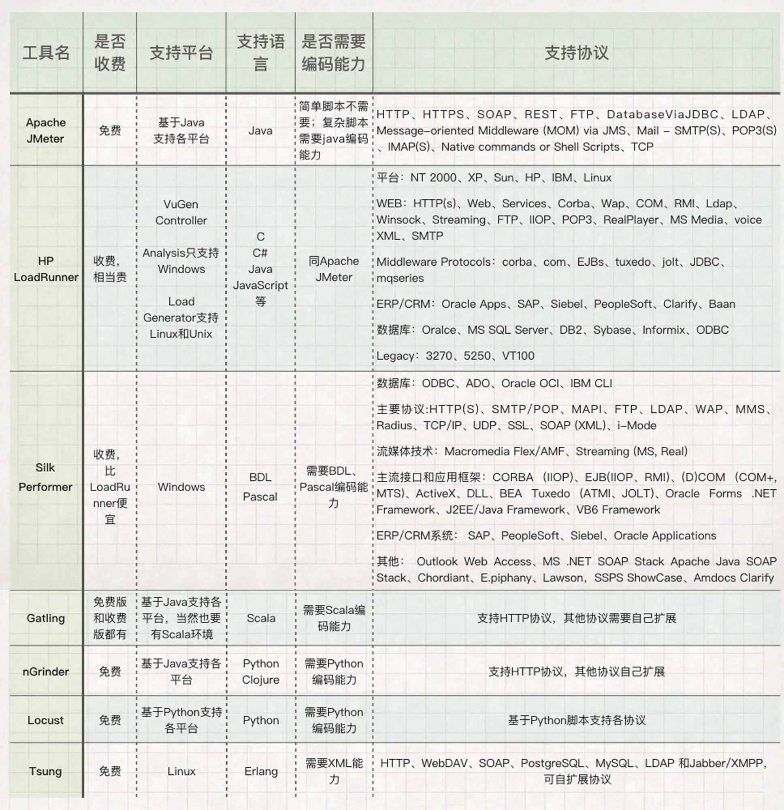

## 性能指标

**常见指标单词**

**258 principle**

其实这是在 80 年代的时候，英国一家 IT 媒体对音乐缓冲服务做的一次调查。在那个年代，得到的结果是，2 秒客户满意度不错；5 秒满意度就下降了，但还有利润；8 秒时，就没有利润了。于是他们就把这个统计数据公布了出来，这样就出现了 258 principle，翻译成中文之后，它就像一个万年不变的定理，深深影响着很多人。

时代发展，行业不同，没啥关系。

**二八定律**

二八定律是19世纪末20世纪初意大利经济学家帕累托发现的。帕累托从大量具体的事实中发现：社会上20%的人占有80%的社会财富，即：财富在人口中的分配是不平衡的。现在这个定律被广泛用在很多领域，比较有名如时间管理认为，20%的时间完成80%的工作。

**性能测试工具**

