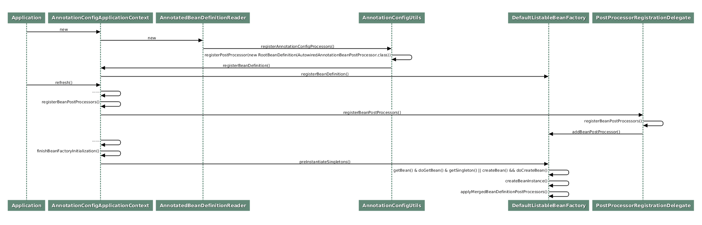

最近在喵极客的[Spring常见编程错误50例](https://time.geekbang.org/column/intro/100077001)，好记性不如烂笔头，这边简单做个笔记。源码放置在[todo-java/geekbang/spring-common-mistakes](https://github.com/jianchengwang/todo-java/tree/main/geekbang/spring-common-mistakes)

## Core

### 1.隐性扫描

```java
--com.example.exlude.controller.ExcludeHelloWorldController
--com.example.springcommonmistakes.SpringCommonMistakesApplication
```

发现`HelloWorldController`的接口不生效，而其类被`@ResetController`注解包含`@Component`注解，按理说应该被Spring扫描装载，

```java
...
@ComponentScan(excludeFilters = { @Filter(type = FilterType.CUSTOM, classes = TypeExcludeFilter.class),
      @Filter(type = FilterType.CUSTOM, classes = AutoConfigurationExcludeFilter.class) })
public @interface SpringBootApplication {
//省略非关键代码
}
```

结合源码`ComponentScanAnnotationParser#parse`

```java
if (basePackages.isEmpty()) {  
   basePackages.add(ClassUtils.getPackageName(declaringClass));  
}
```

可以发现默认的`@ComponentScan`，当 `basePackages` 为空时，扫描的包会是 `declaringClass` 所在的包，即`SpringCommonMistakesApplication`所在的包`com.example.springcommonmistakes`下的Bean才会被Spring自动装载管理。

所以本例中，我们可以使用如下进行修复

```java
@ComponentScan("com.example.exlude.controller")

@ComponentScans(value = { @ComponentScan(value = "com.example.exlude.controller") })
```

结合源码`ConfigurationClassParser#doProcessConfigurationClass`

```java
// Process any @ComponentScan annotations  
Set<AnnotationAttributes> componentScans = AnnotationConfigUtils.attributesForRepeatable(  
      sourceClass.getMetadata(), ComponentScans.class, ComponentScan.class);  
if (!componentScans.isEmpty() &&  
      !this.conditionEvaluator.shouldSkip(sourceClass.getMetadata(), ConfigurationPhase.REGISTER_BEAN)) {  
   for (AnnotationAttributes componentScan : componentScans) {  
      // The config class is annotated with @ComponentScan -> perform the scan immediately  
      Set<BeanDefinitionHolder> scannedBeanDefinitions =  
            this.componentScanParser.parse(componentScan, sourceClass.getMetadata().getClassName());  
      // Check the set of scanned definitions for any further config classes and parse recursively if needed
```

发现会扫描所有`@ComponentScan`和`@ComponentScans`注解配置的`basePackages`，需要注意，**而一旦显式指定其它包，原来的默认扫描包就被忽略了**。

### 隐式依赖

```java
@Service
public class ServiceImpl {
    private String serviceName;
    public ServiceImpl(String serviceName){
        this.serviceName = serviceName;
    }
}
```

当创建一个 Bean 时，调用的方法是 `AbstractAutowireCapableBeanFactory#createBeanInstance`。它主要包含两大基本步骤：寻找构造器和通过反射调用构造器创建实例
`ConstructorResolver#instantiate`
`ConstructorResolver#autowireConstructor`

可以发现构造器执行的时候，找不到serviceName参数的的bean，
所以定义一个即可

```java
@Bean  
public String serviceName(){  
    return "MyServiceName";  
}
```

另外需要注意的时候，当我们定义多个构造函数同时匹配的时候，如果都满足，Spring无从选择，会去调默认的构造函数，如果默认的构造没有，就会报错
`No default constructor found`

### 3.原型Bean失效

```java
@Service
@Scope(ConfigurableBeanFactory.SCOPE_PROTOTYPE)
public class ServiceImpl {
}
```
`AutowiredAnnotationBeanPostProcessor.AutowiredFieldElement#inject：`

```java
protected void inject(Object bean, @Nullable String beanName, @Nullable PropertyValues pvs) throws Throwable {
   Field field = (Field) this.member;
   Object value;
   //寻找“bean”
   if (this.cached) {
      value = resolvedCachedArgument(beanName, this.cachedFieldValue);
   }
   else {
     //省略其他非关键代码
     value = beanFactory.resolveDependency(desc, beanName, autowiredBeanNames, typeConverter);
   }
   if (value != null) {
      //将bean设置给成员字段
      ReflectionUtils.makeAccessible(field);
      field.set(bean, value);
   }
}
```

待我们寻找到要自动注入的 Bean 后，即可通过反射设置给对应的 field。这个 field 的执行只发生了一次，所以后续就固定起来了，它并不会因为 ServiceImpl 标记了 SCOPE_PROTOTYPE 而改变。

当一个单例的 Bean，使用 autowired 注解标记其属性时，你一定要注意这个属性值会被固定下来

解决方案，
1. ApplicationContext
2. Lombok @Lookup
3. @Scope(value = "prototype", proxyMode = ScopedProxyMode.TARGET_CLASS)

备注：
1. `@Scope(value=ConfigurableBeanFactory.SCOPE_PROTOTYPE)`这个是说在每次注入的时候回自动创建一个新的bean实例 
2. `@Scope(value=ConfigurableBeanFactory.SCOPE_SINGLETON)`单例模式，在整个应用中只能创建一个实例 
3. `@Scope(value=WebApplicationContext.SCOPE_GLOBAL_SESSION)`全局session中的一般不常用 
4. `@Scope(value=WebApplicationContext.SCOPE_APPLICATION)`在一个web应用中只创建一个实例 
5. `@Scope(value=WebApplicationContext.SCOPE_REQUEST)`在一个请求中创建一个实例 
6. `@Scope(value=WebApplicationContext.SCOPE_SESSION)`每次创建一个会话中创建一个实例 
7. proxyMode=ScopedProxyMode.INTERFACES创建一个JDK代理模式 proxyMode=ScopedProxyMode.TARGET_CLASS基于类的代理模式 proxyMode=ScopedProxyMode.NO（默认）不进行代理

### 4.发现多个Bean

`required a single bean, but 2 were found`

`AbstractAutowireCapableBeanFactory#createBeanInstance`
`AbstractAutowireCapableBeanFactory#populate`
`AutowiredAnnotationBeanPostProcessor#postProcessProperties`
`AutowiredFieldElement#inject`

匹配多个Bean，且Bean没有优先级，就会报错，

解决方案，
1. `@Primary` 设置优先级
2. 属性名匹配Bean名称
3. `@Qualifier`，注意大小写问题，如果一个类名是以两个大写字母开头的，则首字母不变，其它情况下默认首字母变成小写

### 5.Value没有注入期望值

使用 @Autowired 一般都不会设置属性值，而 @Value 必须指定一个字符串值

`DefaultListableBeanFactory#doResolveDependency`

@Value 的工作大体分为以下三个核心步骤

**a.寻找value**

在这步中，主要是判断这个属性字段是否标记为 @Value，依据的方法参考 `QualifierAnnotationAutowireCandidateResolver#findValue`：

```java
@Nullable
protected Object findValue(Annotation[] annotationsToSearch) {
   if (annotationsToSearch.length > 0) {  
      AnnotationAttributes attr = AnnotatedElementUtils.getMergedAnnotationAttributes(
            AnnotatedElementUtils.forAnnotations(annotationsToSearch), this.valueAnnotationType);
      //valueAnnotationType即为@Value
      if (attr != null) {
         return extractValue(attr);
      }
   }
   return null;
}
```

**b.解析 @Value 的字符串值**

果一个字段标记了 @Value，则可以拿到对应的字符串值，然后就可以根据字符串值去做解析，最终解析的结果可能是一个字符串，也可能是一个对象，这取决于字符串怎么写

**c.将解析结果转化为要装配的对象的类型**

当拿到第二步生成的结果后，我们会发现可能和我们要装配的类型不匹配。假设我们定义的是 UUID，而我们获取的结果是一个字符串，那么这个时候就会根据目标类型来寻找转化器执行转化，字符串到 UUID 的转化实际上发生在 UUIDEditor 中

```java
public class UUIDEditor extends PropertyEditorSupport {

   @Override
   public void setAsText(String text) throws IllegalArgumentException          {
      if (StringUtils.hasText(text)) {
         //转化操作
         setValue(UUID.fromString(text.trim()));
      }
      else {
         setValue(null);
      }
   }
   //省略其他非关代码
  
}
```

通过对上面几个关键步骤的解析，我们大体了解了 @Value 的工作流程。结合我们的案例，很明显问题应该发生在第二步，即解析 Value 指定字符串过程，执行过程参考下面的关键代码行：

```java
String strVal = resolveEmbeddedValue((String) value);
```

这里其实是在解析嵌入的值，实际上就是“替换占位符”工作。具体而言，它采用的是 PropertySourcesPlaceholderConfigurer 根据 PropertySources 来替换。不过当使用 ${username} 来获取替换值时，其最终执行的查找并不是局限在 application.property 文件中的。通过调试，我们可以看到下面的这些“源”都是替换依据：

```java
[ConfigurationPropertySourcesPropertySource {name='configurationProperties'}, StubPropertySource {name='servletConfigInitParams'}, ServletContextPropertySource {name='servletContextInitParams'}, PropertiesPropertySource {name='systemProperties'}, OriginAwareSystemEnvironmentPropertySource {name='systemEnvironment'}, RandomValuePropertySource {name='random'},OriginTrackedMapPropertySource {name='applicationConfig: classpath:/application.properties]'},MapPropertySource {name='devtools'}]
```

所以如果系统配置存在跟我们项目一致的配置，会导致我们的取值不是预期，所以，所以命名时，我们一定要注意不仅要避免和环境变量冲突，也要注意避免和系统变量等其他变量冲突

### 6.List Bean注入问题

`DefaultListableBeanFactory#resolveMultipleBeans`

```java

private Object resolveMultipleBeans(DependencyDescriptor descriptor, @Nullable String beanName,
      @Nullable Set<String> autowiredBeanNames, @Nullable TypeConverter typeConverter) {
   final Class<?> type = descriptor.getDependencyType();
   if (descriptor instanceof StreamDependencyDescriptor) {
      //装配stream
      return stream;
   }
   else if (type.isArray()) {
      //装配数组
      return result;
   }
   else if (Collection.class.isAssignableFrom(type) && type.isInterface()) {
      //装配集合
      //获取集合的元素类型
      Class<?> elementType = descriptor.getResolvableType().asCollection().resolveGeneric();
      if (elementType == null) {
         return null;
      }
      //根据元素类型查找所有的bean
      Map<String, Object> matchingBeans = findAutowireCandidates(beanName, elementType,
            new MultiElementDescriptor(descriptor));
      if (matchingBeans.isEmpty()) {
         return null;
      }
      if (autowiredBeanNames != null) {
         autowiredBeanNames.addAll(matchingBeans.keySet());
      }
      //转化查到的所有bean放置到集合并返回
      TypeConverter converter = (typeConverter != null ? typeConverter : getTypeConverter());
      Object result = converter.convertIfNecessary(matchingBeans.values(), type);
      //省略非关键代码
      return result;
   }
   else if (Map.class == type) {
      //解析map
      return matchingBeans;
   }
   else {
      return null;
   }
}
```

集合装配的大致流程，

**a.获取集合类型的元素类型**

```java
Class elementType = descriptor.getResolvableType().asCollection().resolveGeneric();
```

**b.根据元素类型，找出所有的 Bean**

```java
Map<String, Object> matchingBeans = findAutowireCandidates(beanName, elementType, new MultiElementDescriptor(descriptor));
```

**c.将匹配的所有的 Bean 按目标类型进行转化**

```java
Object result = converter.convertIfNecessary(matchingBeans.values(), type);
```

在对于同一个集合对象的注入上，混合多种注入方式是不可取的，这样除了错乱，别无所得

### 7.构造器内抛空指针异常



这个图初看起来复杂，我们不妨将其分为三部分：
第一部分，将一些必要的系统类，比如 Bean 的后置处理器类，注册到 Spring 容器，其中就包括我们这节课关注的 CommonAnnotationBeanPostProcessor 类；
第二部分，将这些后置处理器实例化，并注册到 Spring 的容器中；
第三部分，实例化所有用户定制类，调用后置处理器进行辅助装配、类初始化等等。第一部分和第二部分并非是我们今天要讨论的重点，这里仅仅是为了让你知道 CommonAnnotationBeanPostProcessor 这个后置处理类是何时被 Spring 加载和实例化的。

现在我们重点看下第三部分，即 Spring 初始化单例类的一般过程，基本都是 getBean()->doGetBean()->getSingleton()，如果发现 Bean 不存在，则调用 createBean()->doCreateBean() 进行实例化。

而用来实例化 Bean 的 createBeanInstance 方法通过依次调用 DefaultListableBeanFactory.instantiateBean() >SimpleInstantiationStrategy.instantiate()，最终执行到 BeanUtils.instantiateClass()，其代码如下：

```java

public static <T> T instantiateClass(Constructor<T> ctor, Object... args) throws BeanInstantiationException {
   Assert.notNull(ctor, "Constructor must not be null");
   try {
      ReflectionUtils.makeAccessible(ctor);
      return (KotlinDetector.isKotlinReflectPresent() && KotlinDetector.isKotlinType(ctor.getDeclaringClass()) ?
            KotlinDelegate.instantiateClass(ctor, args) : ctor.newInstance(args));
   }
   catch (InstantiationException ex) {
      throw new BeanInstantiationException(ctor, "Is it an abstract class?", ex);
   }
   //省略非关键代码
}

```

就是在于**使用 @Autowired 直接标记在成员属性上而引发的装配行为是发生在构造器执行之后的**

备注，Spring 在类属性完成注入之后，会回调用户定制的初始化方法。即在 populateBean 方法之后，会调用 initializeBean 方法，

```java
protected Object initializeBean(final String beanName, final Object bean, @Nullable RootBeanDefinition mbd) {
   //省略非关键代码 
   if (mbd == null || !mbd.isSynthetic()) {
      wrappedBean = applyBeanPostProcessorsBeforeInitialization(wrappedBean, beanName);
   }
   try {
      invokeInitMethods(beanName, wrappedBean, mbd);
   }
   //省略非关键代码 
}
```

这里你可以看到 applyBeanPostProcessorsBeforeInitialization 和 invokeInitMethods 这两个关键方法的执行，它们分别处理了 @PostConstruct 注解和 InitializingBean 接口这两种不同的初始化方案的逻辑

解决方案，
1. 构造参数注入，spring推荐的，详情请自行查阅[spring.io](https://docs.spring.io/spring-framework/docs/3.0.0.M4/reference/html/ch03s04.html)
2. PostConstruct 注解进行修饰
3. InitializingBean.afterPropertiesSet

### 8.意外触发shutdown方法

我们发现只有通过使用 Bean 注解注册到 Spring 容器的对象，才会在 Spring 容器被关闭的时候自动调用 shutdown 方法，而使用 @Component（Service 也是一种 Component）将当前类自动注入到 Spring 容器时，shutdown 方法则不会被自动执行。

使用 Bean 注解的方法所注册的 Bean 对象，如果用户不设置 destroyMethod 属性，则其属性值为 AbstractBeanDefinition.INFER_METHOD。此时 Spring 会检查当前 Bean 对象的原始类中是否有名为 shutdown 或者 close 的方法，如果有，此方法会被 Spring 记录下来，并在容器被销毁时自动执行；当然如若没有，那么自然什么都不会发生。

```java
doCreateBean
->registerDisposableBeanIfNecessary
->registerDisposableBean(new DisposableBeanAdapter)
->inferDestroyMethodIfNecessary
```

`DisposableBeanAdapter#inferDestroyMethodIfNecessary`


